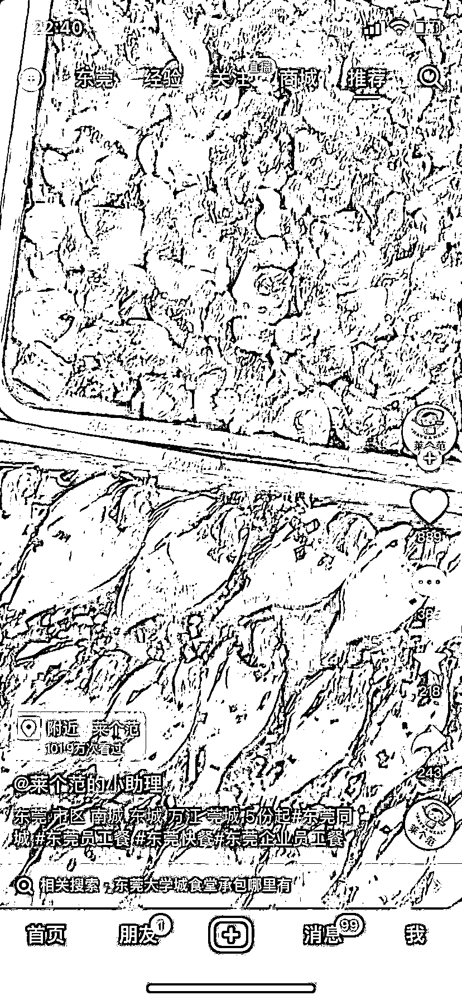

# 抖音发布本地视频，本地包餐需求量大

> 原文：[`www.yuque.com/for_lazy/xkrm14/oiua7m7nb0zap42w`](https://www.yuque.com/for_lazy/xkrm14/oiua7m7nb0zap42w)

<ne-text id="u0fba63f7">作者： 文昭-</ne-text>

<ne-text id="uefbe1c1d">日期：2023-07-20</ne-text>

<ne-text id="u255f44ba">点赞数：</ne-text><ne-text id="ucbd43467" ne-bold="true">105</ne-text>

<ne-hole id="u17c69aab" data-lake-id="u17c69aab"><ne-card data-card-name="hr" data-card-type="block" id="l7Gyt" data-event-boundary="card">

<ne-text id="u75bf6125">正文：</ne-text>

<ne-text id="u4aa0d8ba">坐标广东东莞南城城区 一二线或者其他城市写字楼密集地段 抖音发布本地视频，本地包餐需求量大 从发布以来一直源源不断有需求</ne-text> <ne-text id="u8793d025">因身边有阿姨做学校午托做饭，目前假期，正好刷到这类型的包餐视频，所以跟阿姨说了下，可以考虑去做；也可以让身边一些有厨艺，比较闲的阿姨叔叔考虑做，毕竟都是需要先下单有客源再去做配送，极大减少风险，根据对方需求去做匹配</ne-text>

<ne-card data-card-name="image" data-card-type="inline" id="ovPNI" data-event-boundary="card"></ne-card>

<ne-card data-card-name="image" data-card-type="inline" id="kDnOO" data-event-boundary="card"></ne-card>

<ne-card data-card-name="image" data-card-type="inline" id="BWzdb" data-event-boundary="card"></ne-card>

<ne-hole id="u4bf1632f" data-lake-id="u4bf1632f"><ne-card data-card-name="hr" data-card-type="block" id="jCGdW" data-event-boundary="card">

<ne-text id="u152bc202">评论区：</ne-text>

<ne-text id="uc7707c0f">九歌 : 中标预警</ne-text>

<ne-text id="uf7a0b6a7">大辉冯 : 厉害</ne-text>

<ne-text id="u3056478b">贝壳 : 坐标东莞东坑</ne-text>

<ne-text id="u19efd633">海上周杰伦 : 不懂就问，这个对顾客来说和外卖的区别在哪</ne-text>

<ne-text id="u91733815">龚操 : 外卖是标准化的 有流水线的感觉；找人做的先天就有定制化的感觉；关键价格还不贵</ne-text>

<ne-text id="ud2c94d8a">怡成 : 而且这种很好加素材，比如健康的油，新鲜的食材，等等，比外卖容易入人设</ne-text>

<ne-text id="ua661e3ef">周宇 : 这个真不错，配个每周菜单就更完美了</ne-text>

<ne-hole id="u5c818b98" data-lake-id="u5c818b98"><ne-card data-card-name="hr" data-card-type="block" id="LKCZF" data-event-boundary="card">

<ne-text id="u423df274">公众号懒人找资源，懒人专属群分享</ne-text>

</ne-card></ne-hole></ne-card></ne-hole></ne-card></ne-hole>