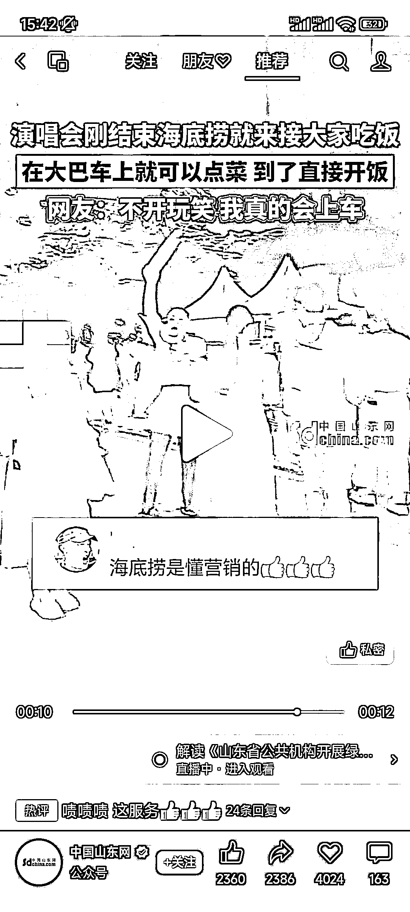

# 海底捞的强大营销策略引起关注

> 原文：[`www.yuque.com/for_lazy/xkrm14/uiamwahnz4v6g5yh`](https://www.yuque.com/for_lazy/xkrm14/uiamwahnz4v6g5yh)

作者： 九香虫

日期：2023-07-20

点赞数：147

<ne-hole id="u59923af6" data-lake-id="u59923af6">

正文：

海底捞这波营销点确实强！

<ne-hole id="u0f7c6042" data-lake-id="u0f7c6042">

评论区：

坏孩（大学生） : 这种有种老纪的感觉，你把客户放心里，客户把你店坐满

韭神 : 优秀

胡二虎🐯 : 开窍了

在路上 : 服务确实不错，送小零食，虽然不贵，感觉好

胡洋 : 踩中需求啊，又蹦又跳，怎能不饿？

春夏 : 🐮

<ne-hole id="ub064d9fa" data-lake-id="ub064d9fa">

公众号懒人找资源，懒人专属群分享

</ne-hole></ne-hole></ne-hole>