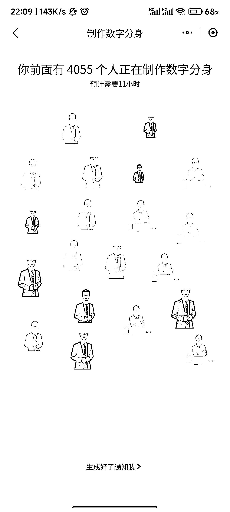

# 妙鸭相机小程序：生成海马体证件照，排队人数超过 4000 人

> 原文：[`www.yuque.com/for_lazy/xkrm14/cvtreg0lh49fumzv`](https://www.yuque.com/for_lazy/xkrm14/cvtreg0lh49fumzv)

<ne-p id="u43dcbad4" data-lake-id="u43dcbad4"><ne-text id="ub4404b7b">作者： 岳嘉</ne-text></ne-p> <ne-p id="u27617797" data-lake-id="u27617797"><ne-text id="u635cb3fe">日期：2023-07-20</ne-text></ne-p> <ne-p id="u94eef96f" data-lake-id="u94eef96f"><ne-text id="u23d666cc">点赞数：</ne-text><ne-text id="u30cb8fec" ne-bold="true">133</ne-text></ne-p> <ne-hole id="u9568ec11" data-lake-id="u9568ec11"><ne-card data-card-name="hr" data-card-type="block" id="pq4as" data-event-boundary="card"><ne-p id="u12c47bea" data-lake-id="u12c47bea"><ne-text id="u5c52479b">正文：</ne-text></ne-p> <ne-p id="u713b48b4" data-lake-id="u713b48b4"><ne-text id="uf4d63890">妙鸭相机小程序，生成海马体，天真蓝类似的证件照，收费 9.9 元， 程序员结合商业真的太厉害了。 前面还有 4000 多人，付费 9.9 元在排队。</ne-text></ne-p> <ne-p id="ud074599d" data-lake-id="ud074599d"><ne-card data-card-name="image" data-card-type="inline" id="FJTae" data-event-boundary="card"></ne-card></ne-p> <ne-p id="u358706eb" data-lake-id="u358706eb"><ne-card data-card-name="image" data-card-type="inline" id="jFNBt" data-event-boundary="card"></ne-card></ne-p> <ne-hole id="uf692d3a5" data-lake-id="uf692d3a5"><ne-card data-card-name="hr" data-card-type="block" id="WMe3u" data-event-boundary="card"><ne-p id="ue5c1168e" data-lake-id="ue5c1168e"><ne-text id="u15fed225">评论区：</ne-text></ne-p> <ne-p id="u4a9e3f57" data-lake-id="u4a9e3f57"><ne-text id="u8e97664e">拾悦说 : 海马体流量真的很大，可以考虑这方面的变现内容。</ne-text></ne-p> <ne-p id="ub4ab2cb8" data-lake-id="ub4ab2cb8"><ne-text id="udb0aa226">大勇非勇 : 问个问题，以我现在的认知水平，看到这样的信息，只能想到以下变现逻辑： 1.在其他平台做流量然后挂小程序通过推广赚佣金；</ne-text> <ne-text id="udec081e1">2.做流量告诉别人你可以提供相关服务，转化后自己用小程序给别人做服务； 3.有技术条件可以进这个赛道分一杯羹。</ne-text> <ne-text id="u0b7d1a14">请问各位大佬，我想的有什么问题或者偏差，还有什么我意识不到的变现逻辑？</ne-text></ne-p> <ne-p id="uaf39f348" data-lake-id="uaf39f348"><ne-text id="uf0240fe5">云珞 YunL : 我也只能想到这个</ne-text></ne-p> <ne-p id="u033d6e93" data-lake-id="u033d6e93"><ne-text id="u2d3876e3">战劲 : 学到了</ne-text></ne-p> <ne-p id="u72cb127a" data-lake-id="u72cb127a"><ne-text id="ud1483071">毛豆 : 体验过了，确实很厉害，基本海马体可以不用去了，我一个男的都玩了挺久，女性群体，应该客单价可以做到很高</ne-text></ne-p> <ne-p id="uf64fbfc8" data-lake-id="uf64fbfc8"><ne-text id="u20cf353c">小隐 : 学到了，学到了，体验了一下，要上传 20 多张图，应该是 AI 炼一个自己模型然后生成图片的，不知道出图率咋样，或者怎么调控保证出图效果的~</ne-text></ne-p> <ne-hole id="ua9737598" data-lake-id="ua9737598"><ne-card data-card-name="hr" data-card-type="block" id="CVNJ7" data-event-boundary="card"><ne-p id="uc11289ee" data-lake-id="uc11289ee"><ne-text id="uaecaa039">公众号懒人找资源，懒人专属群分享</ne-text></ne-p></ne-card></ne-hole></ne-card></ne-hole></ne-card></ne-hole>