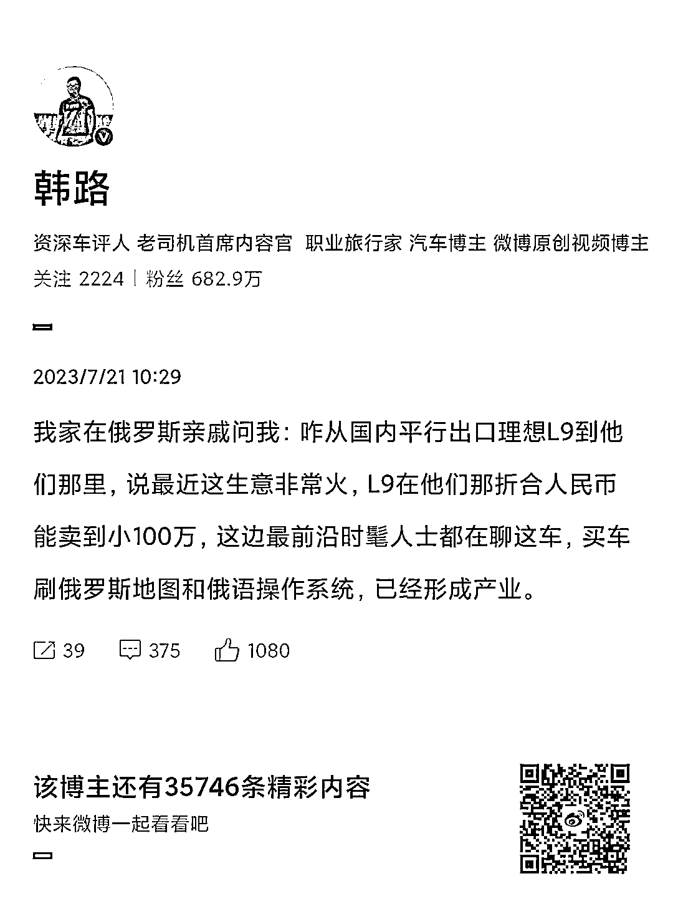

# 刷汽车地图和系统的俄语技术分享

> 原文：[`www.yuque.com/for_lazy/xkrm14/sx3dru412gacii1b`](https://www.yuque.com/for_lazy/xkrm14/sx3dru412gacii1b)

<ne-p id="u4e1725b9" data-lake-id="u4e1725b9"><ne-text id="u53cc3fbb">作者： 严言</ne-text></ne-p> <ne-p id="u3cd2f59d" data-lake-id="u3cd2f59d"><ne-text id="uf91ac399">日期：2023-07-21</ne-text></ne-p> <ne-p id="u2915c7c7" data-lake-id="u2915c7c7"><ne-text id="u5a3f2509">点赞数：</ne-text><ne-text id="u84e92c39" ne-bold="true">117</ne-text></ne-p> <ne-hole id="ue5b38c45" data-lake-id="ue5b38c45"><ne-card data-card-name="hr" data-card-type="block" id="B7LVW" data-event-boundary="card"><ne-p id="u2d6316b8" data-lake-id="u2d6316b8"><ne-text id="u3d42ac25">正文：</ne-text></ne-p> <ne-p id="u121a715b" data-lake-id="u121a715b"><ne-text id="u2e46d7c9">这个算不算风向标，刷汽车的地图和系统，俄语。 理想的车能刷，那其他车也应该能！ 转给技术大拿参考。</ne-text></ne-p> <ne-p id="u15d03cfd" data-lake-id="u15d03cfd"><ne-card data-card-name="image" data-card-type="inline" id="QAUTp" data-event-boundary="card"></ne-card></ne-p> <ne-hole id="uaa5213be" data-lake-id="uaa5213be"><ne-card data-card-name="hr" data-card-type="block" id="onE7I" data-event-boundary="card"><ne-p id="u8cc1df45" data-lake-id="u8cc1df45"><ne-text id="u905b83e8">评论区：</ne-text></ne-p> <ne-p id="u699b44f3" data-lake-id="u699b44f3"><ne-text id="uaaf9c78d">西昂 : 淘宝上很多刷系统的店铺销量都不低。</ne-text></ne-p> <ne-p id="u8eb3d632" data-lake-id="u8eb3d632"><ne-text id="u9756299d">Northrp : 确实有道理 就跟手机刷系统似得</ne-text></ne-p> <ne-p id="u205140f2" data-lake-id="u205140f2"><ne-text id="u8f62594e">阿甘｜豪华车买手 : 汽车的系统都是相对封闭的，不同的品牌门槛不一样，价格也不一样</ne-text></ne-p> <ne-hole id="u5ee98b08" data-lake-id="u5ee98b08"><ne-card data-card-name="hr" data-card-type="block" id="xSV5m" data-event-boundary="card"><ne-p id="ua0acf8bf" data-lake-id="ua0acf8bf"><ne-text id="ufaa335f7">公众号懒人找资源，懒人专属群分享</ne-text></ne-p></ne-card></ne-hole></ne-card></ne-hole></ne-card></ne-hole>