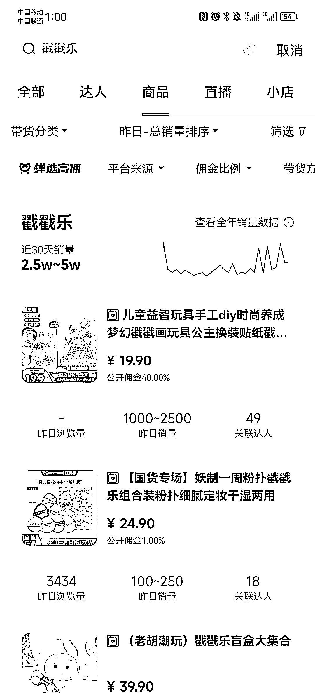

# 热销单品：儿童戳戳乐，让孩子发挥创造力

> 原文：[`www.yuque.com/for_lazy/xkrm14/ckcmyzlarm7go8x7`](https://www.yuque.com/for_lazy/xkrm14/ckcmyzlarm7go8x7)

<ne-text id="u2b8539eb">作者： 黄小刀🔪</ne-text>

<ne-text id="u02ec0ab4">日期：2023-07-18</ne-text>

<ne-text id="u3c9955b5">点赞数：</ne-text><ne-text id="u3e62c0ab" ne-bold="true">118</ne-text>

<ne-hole id="ub9553452" data-lake-id="ub9553452"><ne-card data-card-name="hr" data-card-type="block" id="BCNIv" data-event-boundary="card">

<ne-text id="u9ddf2f3e">正文：</ne-text>

<ne-text id="u53aa6994">因为孩子放暑假，最近热度、转化、销量都在增加的一个单品：儿童图书/益智玩具类目里的“戳戳乐”。 让孩子把花花绿绿的塑料纸，戳进洞洞里，就形成一个作品。</ne-text>

<ne-card data-card-name="image" data-card-type="inline" id="iPtdG" data-event-boundary="card"></ne-card>

<ne-card data-card-name="image" data-card-type="inline" id="AzEN0" data-event-boundary="card"></ne-card>

<ne-hole id="uc20a3c92" data-lake-id="uc20a3c92"><ne-card data-card-name="hr" data-card-type="block" id="MDc1L" data-event-boundary="card">

<ne-text id="u53d9a5dd">评论区：</ne-text>

<ne-text id="ud6f98d26">坏孩（大学生） : 小红书无货源搞上</ne-text>

<ne-text id="u705d6f56">啊牛 : 货源取哪里弄啊，</ne-text>

<ne-text id="u41f6d450">丁巍 : 类似的还有很多，换装贴纸，儿童沙画，涂色的，水宝宝，都比较好卖</ne-text>

<ne-hole id="uf513b31f" data-lake-id="uf513b31f"><ne-card data-card-name="hr" data-card-type="block" id="QMguC" data-event-boundary="card">

<ne-text id="u7172e56c">公众号懒人找资源，懒人专属群分享</ne-text>

</ne-card></ne-hole></ne-card></ne-hole></ne-card></ne-hole>