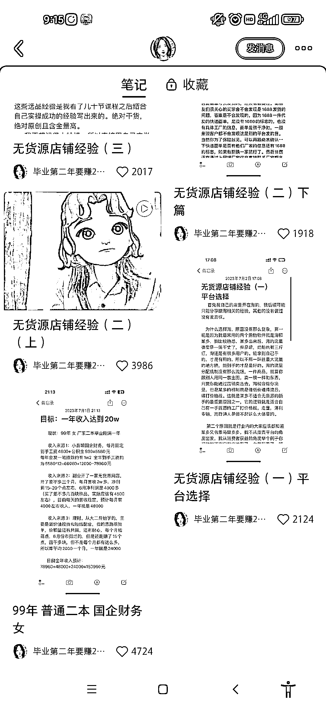

# 十、天涨粉 2 万，无货源店铺经验分享

> 原文：[`www.yuque.com/for_lazy/xkrm14/zwo08rw81hv5eqsg`](https://www.yuque.com/for_lazy/xkrm14/zwo08rw81hv5eqsg)

作者： 动物园园长

日期：2023-07-17

点赞数：76

<ne-hole id="u55bbc6f4" data-lake-id="u55bbc6f4"><ne-card data-card-name="hr" data-card-type="block" id="CPrAZ" data-event-boundary="card">

正文：

无货源店铺经验分享 10 天涨粉 2 万 貌似最近这种没有华丽图片和文案的笔记，点赞收藏都比较多。也许是看腻了精美的图片后，大家更喜欢这种真实接地气的笔记分享。 真诚利他的经验，朴实无华的文字，再加上超强信任感的人设。

<ne-card data-card-name="image" data-card-type="inline" id="FfKYy" data-event-boundary="card"></ne-card>

<ne-card data-card-name="image" data-card-type="inline" id="cIjt8" data-event-boundary="card"></ne-card>

<ne-hole id="u70d24962" data-lake-id="u70d24962"><ne-card data-card-name="hr" data-card-type="block" id="XHsQw" data-event-boundary="card">

评论区：

倪大胖 : 很好奇 关注她的都是财务吗

久违 : 这种账号如何变现？

坏孩（大学生） : 分享小红书，变现的话就会很简单吧。私域卖货

彦威 : 可以卖课程

<ne-hole id="u5aff2850" data-lake-id="u5aff2850"><ne-card data-card-name="hr" data-card-type="block" id="EHnA1" data-event-boundary="card">

公众号懒人找资源，懒人专属群分享

</ne-card></ne-hole></ne-card></ne-hole></ne-card></ne-hole>