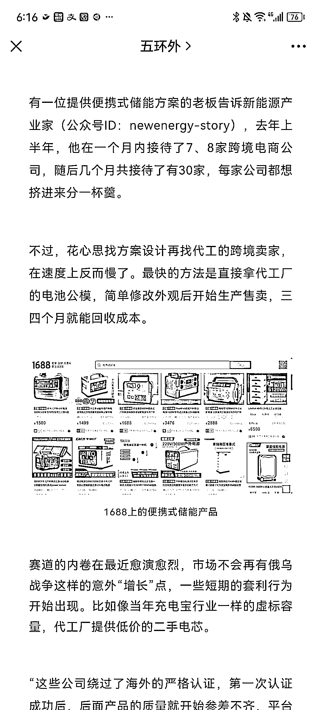

# 东南亚市场成为新能源汽车和电动车出海的热门目标

> 原文：[`www.yuque.com/for_lazy/xkrm14/ei97gnvgsva7k7xf`](https://www.yuque.com/for_lazy/xkrm14/ei97gnvgsva7k7xf)

作者： SOHO 佳文

日期：2023-07-21

点赞数：74

<ne-hole id="u70a2401b" data-lake-id="u70a2401b"><ne-card data-card-name="hr" data-card-type="block" id="Oz3tu" data-event-boundary="card">

正文：

关于户储的确疯狂，尤其是去年下半年开始，目前还在主要在东南亚还是在大力发展新能源，新能源汽车出海，两轮电动出海，电摩出海的机会还都比较大

<ne-card data-card-name="image" data-card-type="inline" id="OMCzL" data-event-boundary="card"></ne-card>

<ne-hole id="u6cfa6919" data-lake-id="u6cfa6919"><ne-card data-card-name="hr" data-card-type="block" id="kFr0I" data-event-boundary="card">

评论区：

杰米 : 这种电源在家里充电安全吗？

SOHO 佳文 : 安全的，当然最好是选择大公司的产品

<ne-hole id="u105bf556" data-lake-id="u105bf556"><ne-card data-card-name="hr" data-card-type="block" id="tl1fg" data-event-boundary="card">

公众号懒人找资源，懒人专属群分享

</ne-card></ne-hole></ne-card></ne-hole></ne-card></ne-hole>