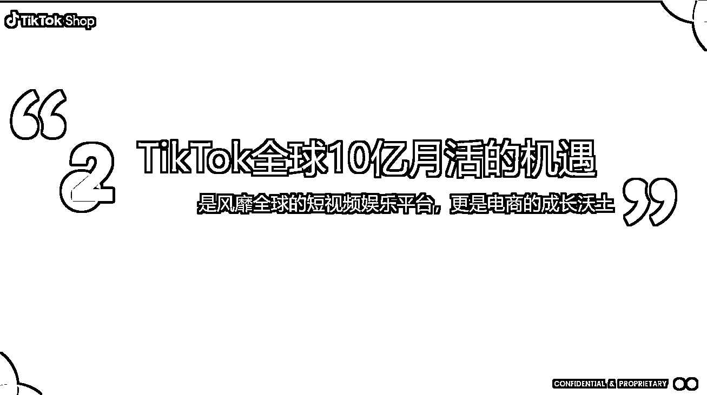

# Tik Tok 平台全托管模式开启，跨境电商迎来新风口

> 原文：[`www.yuque.com/for_lazy/xkrm14/un6flxeexl0qemcs`](https://www.yuque.com/for_lazy/xkrm14/un6flxeexl0qemcs)

作者： 皮特船长

日期：2023-07-18

点赞数：82

<ne-hole id="u141fd89c" data-lake-id="u141fd89c"><ne-card data-card-name="hr" data-card-type="block" id="aC3u5" data-event-boundary="card">

正文：

跨境电商新风口全托管，Tik Tok 平台开启新一轮补贴 今年北美跨境电商注定是血雨腥风的一年，temu、shein、tiktok 都在默默发力 特别是 tiktok 最近动作频繁，除了推动直播带货以外，也重点发展全托管模式。 目前作为首批入驻全托管商家也在和平台跑一些新模式， 每条带货短视频可以获得平台 30 美金的流量补贴。 跨境卖家特别是有一定内容能力的赶紧跟上了

<ne-card data-card-name="image" data-card-type="inline" id="V1xbz" data-event-boundary="card"></ne-card>

<ne-card data-card-name="image" data-card-type="inline" id="sIuGl" data-event-boundary="card"></ne-card>

<ne-card data-card-name="image" data-card-type="inline" id="B93sj" data-event-boundary="card"></ne-card>

<ne-hole id="u24c94e2d" data-lake-id="u24c94e2d"><ne-card data-card-name="hr" data-card-type="block" id="GrGFN" data-event-boundary="card">

评论区：

Mr.拾捌 : 这个内容截图有没完整版的材料发来了解下哦

kinhu : 有没什么方法带一下[呲牙]

波叔 : 大佬求带

坏孩（大学生） : 大佬求带

<ne-hole id="u874edd33" data-lake-id="u874edd33"><ne-card data-card-name="hr" data-card-type="block" id="dtk9b" data-event-boundary="card">

公众号懒人找资源，懒人专属群分享

</ne-card></ne-hole></ne-card></ne-hole></ne-card></ne-hole>