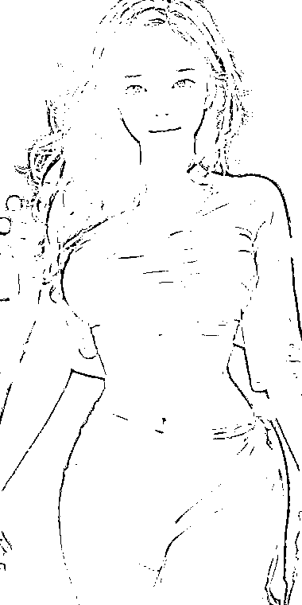

# 利用 AI 绘图和微信隐写术进行个人 IP 名片引流

> 原文：[`www.yuque.com/for_lazy/xkrm14/uyxcosbagxz41gw7`](https://www.yuque.com/for_lazy/xkrm14/uyxcosbagxz41gw7)

<ne-text id="u8384b204">作者： 玉米</ne-text>

<ne-text id="u28629493">日期：2023-07-10</ne-text>

<ne-text id="ud0473f74">点赞数：</ne-text><ne-text id="u59567871" ne-bold="true">77</ne-text>

<ne-hole id="u6cafa76c" data-lake-id="u6cafa76c"><ne-card data-card-name="hr" data-card-type="block" id="tQ998" data-event-boundary="card">

<ne-text id="u5618d558">正文：</ne-text>

<ne-text id="uee7203bd">ai 绘图+微信隐写术=个人 ip 名片引流</ne-text> <ne-text id="u1d0d0fb7">自写了个代码，用 sd 生成的图片，或者随便喜欢的图，无痕嵌入微信个人二维码，转发在微信群里点开长按，或者保存图片微信扫一扫这图片，可以直接跳转加好友（效果图 4）</ne-text> <ne-text id="ubd6c6e42">资源对接 合作测试，业务推广扩展，社群运营 ps：扩展应用还有很多，二维码可以换成你想要任何内容</ne-text>

<ne-card data-card-name="image" data-card-type="inline" id="pEBdR" data-event-boundary="card"></ne-card>

<ne-card data-card-name="image" data-card-type="inline" id="KWLSe" data-event-boundary="card"></ne-card>

<ne-card data-card-name="image" data-card-type="inline" id="POe1g" data-event-boundary="card"></ne-card>

<ne-card data-card-name="image" data-card-type="inline" id="iIJVt" data-event-boundary="card"></ne-card>

<ne-hole id="u6dfb629a" data-lake-id="u6dfb629a"><ne-card data-card-name="hr" data-card-type="block" id="Q8HOd" data-event-boundary="card">

<ne-text id="ua88d132e">评论区：</ne-text>

<ne-text id="u73e50767">smile</ne-text> <ne-text id="ud8bc3273" ne-sup="true">~</ne-text> <ne-text id="u7ad97d78">: 有隐藏图小程序，不过为啥你这个隐藏图是有颜色的[666]</ne-text>

<ne-text id="ue208a962">玉米 : 原理和代码都自己根据图像学原理重新设计自己开发的，黑白图不美观且用在电子名片比较晦气</ne-text>

<ne-text id="u00db56e3">艺术家 刘遥磊 : 高级</ne-text>

<ne-text id="u55289878">Alex : 恭喜中标[呲牙]</ne-text>

<ne-text id="u74b966b3">程序员八两 : 强！嵌入这个过程可以自动化么？我这边上线了个一样功能的小程序，但是生成图片是灰色的😂</ne-text>

<ne-text id="uf075ae3c">玉米 : 为啥不可以呢？小程序收入如何？</ne-text>

<ne-text id="ue0c14344">程序员八两 : 喔，我还以为是用 ps，要人工处理。 我们做的是免费小程序[捂脸]后面迭代几个版本再看看变现</ne-text>

<ne-hole id="ua16568b3" data-lake-id="ua16568b3"><ne-card data-card-name="hr" data-card-type="block" id="qzDAv" data-event-boundary="card">

<ne-text id="u2676e841">公众号懒人找资源，懒人专属群分享</ne-text>

</ne-card></ne-hole></ne-card></ne-hole></ne-card></ne-hole>