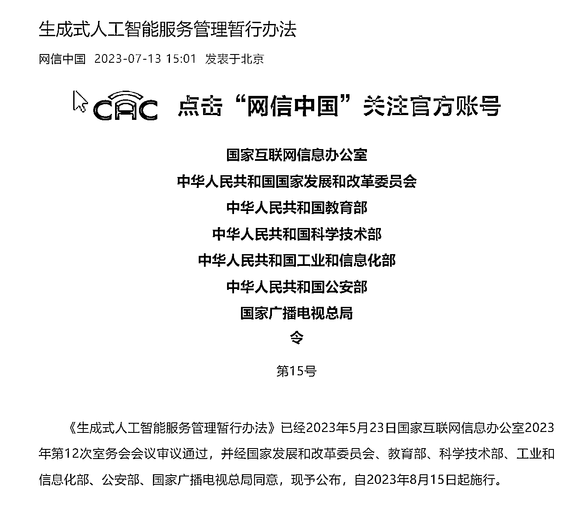
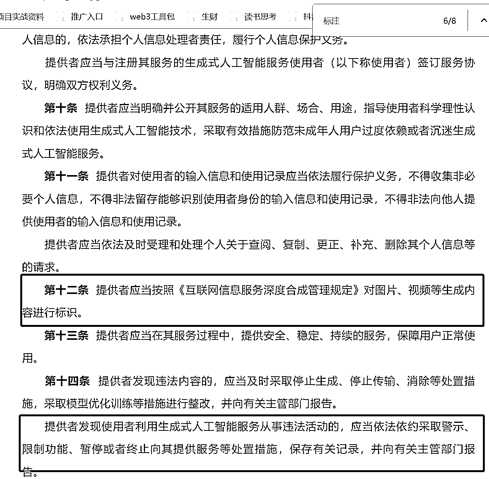

# 网信办发布 AICG 生成式人工智能服务管理暂行办法，行业伙伴需关注

> 原文：[`www.yuque.com/for_lazy/xkrm14/mr37wfu283ybysyz`](https://www.yuque.com/for_lazy/xkrm14/mr37wfu283ybysyz)

<ne-text id="u84ce14db">作者： 追风少年-付费投流</ne-text>

<ne-text id="u1a5b6b7e">日期：2023-07-13</ne-text>

<ne-text id="u21bf4db6">点赞数：</ne-text><ne-text id="u1627d908" ne-bold="true">32</ne-text>

<ne-hole id="ue42dae05" data-lake-id="ue42dae05"><ne-card data-card-name="hr" data-card-type="block" id="Go3Tl" data-event-boundary="card">

<ne-text id="u6277aac4">正文：</ne-text>

<ne-text id="uc4616e8f">前几日的自媒体 13 条新规出来之后，网信办马上推出了关于 AICG 生成式人工智能服务管理暂行办法 在做 AICG 的伙伴都值得重点关注一下</ne-text> [<ne-text id="ud6b5747a">生成式人工智能服务管理暂行办法</ne-text>](https://mp.weixin.qq.com/s/TztAWbEJmA3qBCiLgvZMyg)

<ne-card data-card-name="image" data-card-type="inline" id="FLkuz" data-event-boundary="card">  <ne-p id="u7535cfc4" data-lake-id="u7535cfc4"><ne-card data-card-name="image" data-card-type="inline" id="rTqPo" data-event-boundary="card"></ne-card>

<ne-hole id="udde94e69" data-lake-id="udde94e69"><ne-card data-card-name="hr" data-card-type="block" id="VQ51D" data-event-boundary="card">

<ne-text id="u68bba45b">评论区：</ne-text>

<ne-hole id="u8936c2b5" data-lake-id="u8936c2b5"><ne-card data-card-name="hr" data-card-type="block" id="H0aNM" data-event-boundary="card">

<ne-text id="u59c603b1">公众号懒人找资源，懒人专属群分享</ne-text>

</ne-card></ne-hole></ne-card></ne-hole></ne-card></ne-p></ne-card></ne-hole>