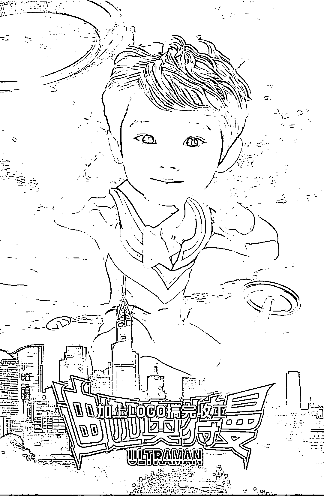

# 小红书刷到的 AI+PS 技巧：奥特曼合成小朋友头像和壁纸

> 原文：[`www.yuque.com/for_lazy/xkrm14/rii7s6qd9dn87vz9`](https://www.yuque.com/for_lazy/xkrm14/rii7s6qd9dn87vz9)

作者： 拖拉机不拖拉

日期：2023-07-10

点赞数：113

<ne-hole id="u9d2740a5" data-lake-id="u9d2740a5"><ne-card data-card-name="hr" data-card-type="block" id="tT8Z9" data-event-boundary="card">

正文：

小红书刷到的，ai+ps，利用奥特曼合成小朋友头像，壁纸

<ne-card data-card-name="image" data-card-type="inline" id="he3Qc" data-event-boundary="card"></ne-card>

<ne-hole id="ue8faf7a6" data-lake-id="ue8faf7a6"><ne-card data-card-name="hr" data-card-type="block" id="sMst6" data-event-boundary="card">

评论区：

拖拉机不拖拉 : 感谢亦仁大大

贝壳 : 我儿子肯定喜欢

拖拉机不拖拉 : 可以试着给他做一个[呲牙]

令狐冲 : 小红书上我搜索不到，能发我链接看看嘛，谢谢哈

拖拉机不拖拉 : 私信你了，我不知道能不能在评论区发

滴水穿石 : 可以发评论区

<ne-hole id="ubc4a087c" data-lake-id="ubc4a087c"><ne-card data-card-name="hr" data-card-type="block" id="t5x1T" data-event-boundary="card">

公众号懒人找资源，懒人专属群分享

</ne-card></ne-hole></ne-card></ne-hole></ne-card></ne-hole>