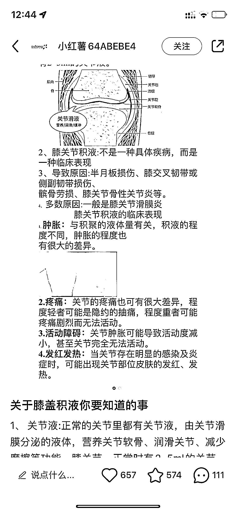

# 小红书成为康复行业的精准用户引流平台

> 原文：[`www.yuque.com/for_lazy/xkrm14/bddegm9emu8wntvs`](https://www.yuque.com/for_lazy/xkrm14/bddegm9emu8wntvs)

作者： Vivi|每日成长 *

日期：2023-07-14

点赞数：92

<ne-hole id="u4dc4a392" data-lake-id="u4dc4a392">

正文：

一些做康复的小众垂直行业，通过小红书简单科普，下面的评论全是精准用户。引导到线下。或者后期直接在线上进行诊断。 虽然才有几百个粉丝，但是精准流量；如果带来转化，1 个差不多就是四位数的客单价。

<ne-hole id="uad255e49" data-lake-id="uad255e49">

评论区：

颜星辰 : 流量确实很精准，而且这块客户有付费意愿，愿意支付高客单，属于小众高客单的赛道了

胖大魔 : 收割一波，后续就没啥用的，长沙南京康复技术拉胯[呲牙]

小白脸 : 抓住大健康趋势吗

胖大魔 :

胖大魔 : 要非常高的包装与交付

Vivi|每日成长 * : 果然还得内部才知道的真相 不过商业的一部分本来就是包装吧….

Vivi|每日成长 * : 谢谢亦仁大大！

<ne-hole id="u30d74b38" data-lake-id="u30d74b38">

公众号懒人找资源，懒人专属群分享

</ne-hole></ne-hole></ne-hole>