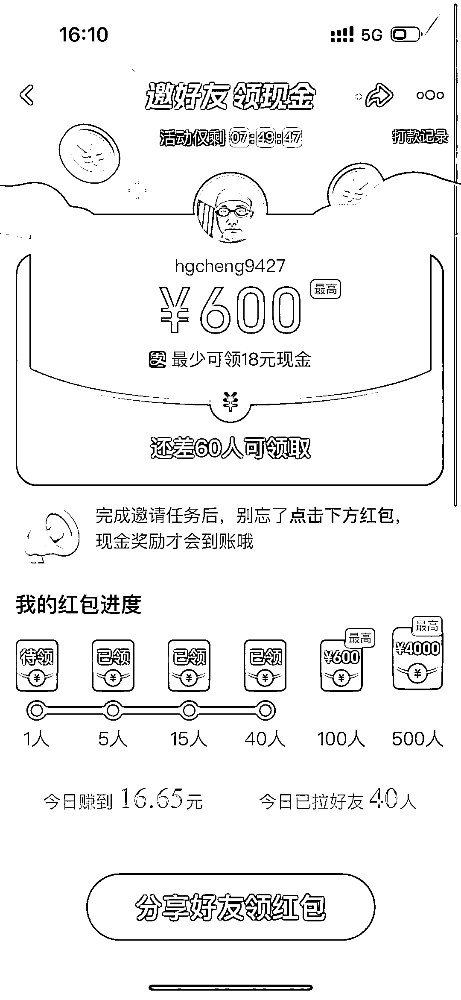

# 淘宝发力短视频，烧钱推广赚钱新途径

> 原文：[`www.yuque.com/for_lazy/xkrm14/grz0ikpvu8di77ru`](https://www.yuque.com/for_lazy/xkrm14/grz0ikpvu8di77ru)

作者： 老胡

日期：2023-07-14

点赞数：103

<ne-hole id="ub8a76299" data-lake-id="ub8a76299">

正文：

淘宝牛逼了，发力短视频，先烧钱再说，看视频就发钱，直接打款到支付宝账户，赶紧保存图片，打开淘宝 App 扫码即可领钱，我测试了下赚了 16 块大洋。 淘宝终于清醒过来了，开始发力短视频，把逛逛从首页下线了，直接换成视频频道，开始做大量的烧钱推广，邀请好友去手淘看视频就能赚钱，用户来了连续多天签到可以领钱，刷视频还可以领钱，总之就是烧钱把视频频道做起来。 虽然这一步来的太晚了，但是方向是没错的，等视频频道流量起来了就做短视频和直播带货。其实如果三年前做就好了，那时候时机会更好，花了那么多时间精力去做图文内容，浪费了大量的金钱和时间。

<ne-hole id="u0c307194" data-lake-id="u0c307194">

评论区：

锋哥 : 确实直接打款，打款 0.1

老胡 : 我赚到 50 了[偷笑]

锋哥 : 不一样你是拉人[捂脸]

老胡 : 你也可以试试看，阿里烧钱

锋哥 : [OK]

涟漪 : 请问是在逛逛里面吗？

老胡 : 打开淘宝 App 扫码我的那个码看看

老胡 : 逛逛从首页下线了，换成了视频

<ne-hole id="uf932fbdd" data-lake-id="uf932fbdd">

公众号懒人找资源，懒人专属群分享

</ne-hole></ne-hole></ne-hole>