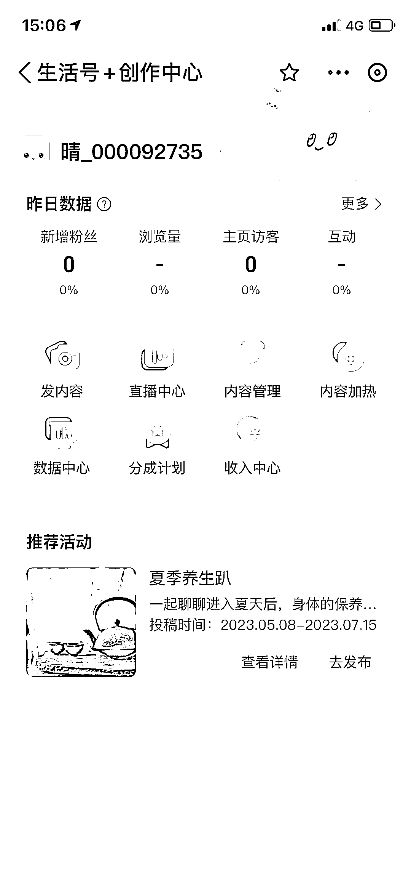

# 支付宝开设视频板块并推出收益分成计划

> 原文：[`www.yuque.com/for_lazy/xkrm14/ag4owewzwgm9b7a7`](https://www.yuque.com/for_lazy/xkrm14/ag4owewzwgm9b7a7)

作者： 君威

日期：2023-07-14

点赞数：78

<ne-hole id="u610f85c6" data-lake-id="u610f85c6">

正文：

支付宝开视频板块了，同时开了收益分成计划，可以理解成类似中视频这样的收益扶持 入口:支付宝-生活-右上角头像-创作者中心-分成计划

<ne-hole id="ub20cec99" data-lake-id="ub20cec99">

评论区：

怪力小乔巴 : 还得努力提升粉丝数

<ne-hole id="u4a214a11" data-lake-id="u4a214a11">

公众号懒人找资源，懒人专属群分享

</ne-hole></ne-hole></ne-hole>