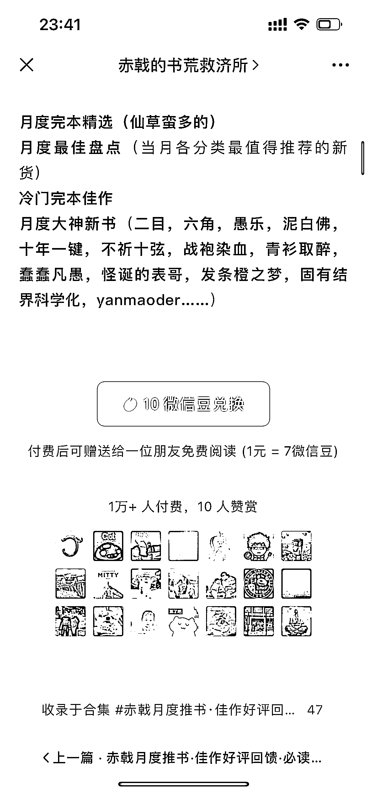

# 公众号小说推荐赛道

> 原文：[`www.yuque.com/for_lazy/xkrm14/teyxx7bon1hr76pf`](https://www.yuque.com/for_lazy/xkrm14/teyxx7bon1hr76pf)

作者： 金九渊

日期：2023-07-10

点赞数：102

<ne-hole id="ubff227d6" data-lake-id="ubff227d6"><ne-card data-card-name="hr" data-card-type="block" id="gxdeR" data-event-boundary="card">

正文：

公众号小说推荐赛道，每月月中发布付费文章 1 人 1 块，付费人数 1w+，每篇文章阅读 5w+

<ne-card data-card-name="image" data-card-type="inline" id="gFYfb" data-event-boundary="card"></ne-card>

<ne-card data-card-name="image" data-card-type="inline" id="t7pXk" data-event-boundary="card"></ne-card>

<ne-hole id="ua945ab97" data-lake-id="ua945ab97"><ne-card data-card-name="hr" data-card-type="block" id="AOaWQ" data-event-boundary="card">

评论区：

胖大魔 : 已经收藏

九歌 : AI 写小说

云端 : 请问一下，谁知道他说的大数据挖掘，具体问问操作？用什么工具啊？我也在做小说推文公众号，不知道怎么找现在搜索量高的小说

喵小白的艾兮 : 同问，要挖一挖了，你做的男频？

云端 : 没做男频

周梦行 : 他文中的大多数数据是自己写的程序采集获取的，在优书网，龙空，起点，纵横等几个网文论坛/平台就有现成的。

周梦行 : 和赤戟比较熟，他这个号做起来是挺不容易的，7.8 年前他就在网文圈做书评推书了，最早在龙空，微博小程序知乎优书网都有他的身影。他这个书荒救济所的号，粉丝都是老书虫了，绝大多数是从龙空优书来的，粘性很强，也愿意支持赤戟；每篇文章下面的评论区互动率很高，是书友们书单交流场。他本人之前是算法相关从业者，也在网文行业待过，所以对网文数据的获取和处理也非常有方法心得。现在还能坚持更新，时不时还在论坛互动，很不容易的。类似的账号还可以看看艾尔天空，九哥推书等等。

远方 : 这是专业的团队在做

<ne-hole id="uacc845fb" data-lake-id="uacc845fb"><ne-card data-card-name="hr" data-card-type="block" id="J9OeT" data-event-boundary="card">

公众号懒人找资源，懒人专属群分享

</ne-card></ne-hole></ne-card></ne-hole></ne-card></ne-hole>