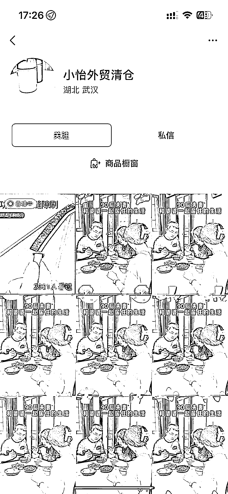
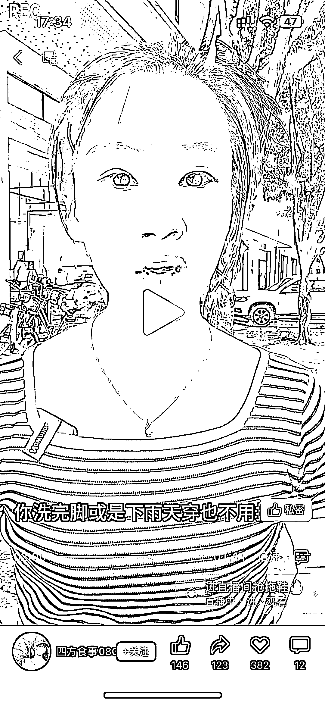

# 视频号带货玩法破流小技巧：利用短剧混剪带货商品

> 原文：[`www.yuque.com/for_lazy/xkrm14/bi5a6024cgt01yh6`](https://www.yuque.com/for_lazy/xkrm14/bi5a6024cgt01yh6)

<ne-p id="u8e9c2597" data-lake-id="u8e9c2597"><ne-text id="ucf30db30">作者： 冲冲冲</ne-text></ne-p> <ne-p id="u85c806d3" data-lake-id="u85c806d3"><ne-text id="u39d0456c">日期：2023-07-12</ne-text></ne-p> <ne-p id="u69dba0ee" data-lake-id="u69dba0ee"><ne-text id="u4e1942db">点赞数：</ne-text><ne-text id="ucadc8eca" ne-bold="true">73</ne-text></ne-p> <ne-hole id="uc9372730" data-lake-id="uc9372730"><ne-card data-card-name="hr" data-card-type="block" id="aFkC6" data-event-boundary="card"><ne-p id="ue3d79b29" data-lake-id="ue3d79b29"><ne-text id="u67b1feda">正文：</ne-text></ne-p> <ne-p id="u853846d3" data-lake-id="u853846d3"><ne-text id="u7c62505d">最近很火的视频号带货玩法作品破流小技巧，观察了很多同行，发作品的素材与带货产品相关性不强的话挂不了商品，太强的话吸引力一般没流量</ne-text> <ne-text id="u53a2c9e8">如下图我随便找了几个同行，大家可以对比</ne-text> <ne-text id="u9de23b1c">这个时候有个小技巧，利用短剧➕带货商品作品混剪的方式来拉流量，也不容易判作品不相干，具体操作大家可以看最后三张图，流量远高于前边的操作</ne-text> <ne-text id="ue7f59612">具体操作：找一段剧情素材播放到带货阶段利用剪映拼接上自己的产品，然后接下来一段产品的讲解混剪视频（能真人出镜最好） 参考数据：作品点赞量，直播间场观</ne-text></ne-p> <ne-p id="u7c4b1587" data-lake-id="u7c4b1587"><ne-card data-card-name="image" data-card-type="inline" id="Odd6w" data-event-boundary="card"></ne-card></ne-p> <ne-p id="u7852ecbd" data-lake-id="u7852ecbd"><ne-card data-card-name="image" data-card-type="inline" id="A5QNn" data-event-boundary="card"></ne-card></ne-p> <ne-p id="ua5da59c6" data-lake-id="ua5da59c6"><ne-card data-card-name="image" data-card-type="inline" id="iJkzl" data-event-boundary="card"></ne-card></ne-p> <ne-p id="u0425b9ac" data-lake-id="u0425b9ac"><ne-card data-card-name="image" data-card-type="inline" id="N9kVl" data-event-boundary="card"></ne-card></ne-p> <ne-p id="u1c98a05c" data-lake-id="u1c98a05c"><ne-card data-card-name="image" data-card-type="inline" id="kHy5E" data-event-boundary="card"></ne-card></ne-p> <ne-p id="u837824bf" data-lake-id="u837824bf"><ne-card data-card-name="image" data-card-type="inline" id="Ljk9x" data-event-boundary="card"></ne-card></ne-p> <ne-p id="ud32c979a" data-lake-id="ud32c979a"><ne-card data-card-name="image" data-card-type="inline" id="LmWP7" data-event-boundary="card"></ne-card></ne-p> <ne-p id="u0bcbdfcb" data-lake-id="u0bcbdfcb"><ne-card data-card-name="image" data-card-type="inline" id="hVKob" data-event-boundary="card"></ne-card></ne-p> <ne-hole id="u22970c90" data-lake-id="u22970c90"><ne-card data-card-name="hr" data-card-type="block" id="eJQs0" data-event-boundary="card"><ne-p id="u0eb28b04" data-lake-id="u0eb28b04"><ne-text id="uff65a840">评论区：</ne-text></ne-p> <ne-p id="u2bb3ece1" data-lake-id="u2bb3ece1"><ne-text id="u4c348dce">顾奇 : 这种就是狂怼 成本就是 ：废号 基本一天一个号就完了</ne-text></ne-p> <ne-p id="uc4fceb01" data-lake-id="uc4fceb01"><ne-text id="uc8733a7d">冲冲冲 : 狂怼也有流量高低之分，可以按照这个方法，流量高度会高很多</ne-text></ne-p> <ne-p id="uf4438a77" data-lake-id="uf4438a77"><ne-text id="uae3f7b8b">花甲刺客 : 一天怼多少条😂</ne-text></ne-p> <ne-p id="u6ddf0e85" data-lake-id="u6ddf0e85"><ne-text id="ue7dac71b">冲冲冲 : 3-5 条就行，播放过 200 都可以开播了。</ne-text></ne-p> <ne-p id="u55e86f61" data-lake-id="u55e86f61"><ne-text id="ud4c88595">花甲刺客 : 这样废号？</ne-text></ne-p> <ne-p id="u0c3390f4" data-lake-id="u0c3390f4"><ne-text id="ue63ae2b2">冲冲冲 : 不是废号，是系统就给一次推流的机会。</ne-text></ne-p> <ne-p id="uf0394658" data-lake-id="uf0394658"><ne-text id="u82b929f3">大蜂 : 最近全是这种，直播间也全是素人，河南 IP 居多，带的产品也多是 9.9 元的人群很泛的家居日用品，怀疑是同一个团队教出来的</ne-text></ne-p> <ne-hole id="u4e1b8cbe" data-lake-id="u4e1b8cbe"><ne-card data-card-name="hr" data-card-type="block" id="xujCN" data-event-boundary="card"><ne-p id="uc8cdb9bf" data-lake-id="uc8cdb9bf"><ne-text id="udeecb61c">公众号懒人找资源，懒人专属群分享</ne-text></ne-p></ne-card></ne-hole></ne-card></ne-hole></ne-card></ne-hole>