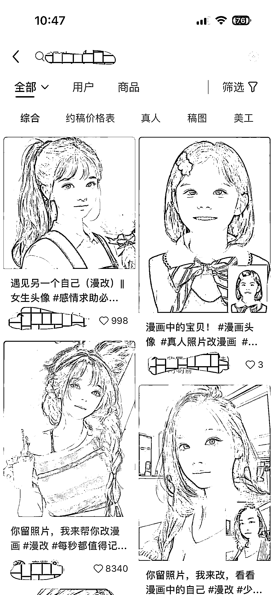

# 人物图像改漫画，简单操作月收入过万，适合大学生和有空闲时间的人

> 原文：[`www.yuque.com/for_lazy/xkrm14/gb90qgpw7yd55g7p`](https://www.yuque.com/for_lazy/xkrm14/gb90qgpw7yd55g7p)

<ne-p id="ue48bee79" data-lake-id="ue48bee79"><ne-text id="u455d20dd">作者： 星星之火</ne-text></ne-p> <ne-p id="uca63c17a" data-lake-id="uca63c17a"><ne-text id="uc715ba3b">日期：2023-07-13</ne-text></ne-p> <ne-p id="u8596ca19" data-lake-id="u8596ca19"><ne-text id="u116462b2">点赞数：</ne-text><ne-text id="u327b7262" ne-bold="true">193</ne-text></ne-p> <ne-hole id="u821381cb" data-lake-id="u821381cb"><ne-card data-card-name="hr" data-card-type="block" id="oz416" data-event-boundary="card"><ne-p id="u99149dfc" data-lake-id="u99149dfc"><ne-text id="u004a5e4e">正文：</ne-text></ne-p> <ne-p id="u833d4eca" data-lake-id="u833d4eca"><ne-text id="u8a6c84e5">分享一个我这几天实操的一个小项目，人物图像改漫画，第三天就开始收钱，昨天作图收益 290，还收了学徒。需求挺大的。一个账号一个月收益 4000 起步，三个账号可以过万，大学生，或者有空闲时间的可以弄，一个手机就可以，不需要电脑。我研究了 2 天就超越了绝大多数高粉丝同行。</ne-text></ne-p> <ne-p id="udee9a4fd" data-lake-id="udee9a4fd"><ne-card data-card-name="image" data-card-type="inline" id="T9A8L" data-event-boundary="card"></ne-card></ne-p> <ne-p id="ud4ef0a82" data-lake-id="ud4ef0a82"><ne-card data-card-name="image" data-card-type="inline" id="CHUdX" data-event-boundary="card"></ne-card></ne-p> <ne-p id="uf0bac921" data-lake-id="uf0bac921"><ne-card data-card-name="image" data-card-type="inline" id="HuWbA" data-event-boundary="card"></ne-card></ne-p> <ne-p id="uab8ac358" data-lake-id="uab8ac358"><ne-card data-card-name="image" data-card-type="inline" id="R691n" data-event-boundary="card"></ne-card></ne-p> <ne-p id="u38ebf586" data-lake-id="u38ebf586"><ne-card data-card-name="image" data-card-type="inline" id="dRo0S" data-event-boundary="card"></ne-card></ne-p> <ne-p id="u562f0462" data-lake-id="u562f0462"><ne-card data-card-name="image" data-card-type="inline" id="YmV6L" data-event-boundary="card"></ne-card></ne-p> <ne-hole id="u4325dea5" data-lake-id="u4325dea5"><ne-card data-card-name="hr" data-card-type="block" id="hpcyN" data-event-boundary="card"><ne-p id="u5f63fb9b" data-lake-id="u5f63fb9b"><ne-text id="u45c3caf9">评论区：</ne-text></ne-p> <ne-p id="uc8185615" data-lake-id="uc8185615"><ne-text id="u189c2b1f">沐码人 : 请问是用什么软件改漫画的呀？</ne-text></ne-p> <ne-p id="u7e8cde9c" data-lake-id="u7e8cde9c"><ne-text id="ud971ba43">文平🐜 : 同问</ne-text></ne-p> <ne-p id="u6d0828ec" data-lake-id="u6d0828ec"><ne-text id="u651236b6">秋闯 : 同问</ne-text></ne-p> <ne-p id="ud71bdd2c" data-lake-id="ud71bdd2c"><ne-text id="u64f5fc34">星星之火 : 漫画相机，美图，都有这个功能</ne-text></ne-p> <ne-p id="ufc8de7a1" data-lake-id="ufc8de7a1"><ne-text id="u3c3d342f">Sunwei : 👍 怎么避免引流私域不被限制/判违规的？</ne-text></ne-p> <ne-p id="u1d64ca6f" data-lake-id="u1d64ca6f"><ne-text id="u2ffd29c1">哈哈😆 : 请问就是用这两个软件改的嘛，不需要 mj 之类的吗</ne-text></ne-p> <ne-p id="u6dd1805a" data-lake-id="u6dd1805a"><ne-text id="u09398000">msft : 这是 sd 的什么模型</ne-text></ne-p> <ne-hole id="u30909a71" data-lake-id="u30909a71"><ne-card data-card-name="hr" data-card-type="block" id="EhrK2" data-event-boundary="card"><ne-p id="uc669108a" data-lake-id="uc669108a"><ne-text id="u0afd0617">公众号懒人找资源，懒人专属群分享</ne-text></ne-p></ne-card></ne-hole></ne-card></ne-hole></ne-card></ne-hole>