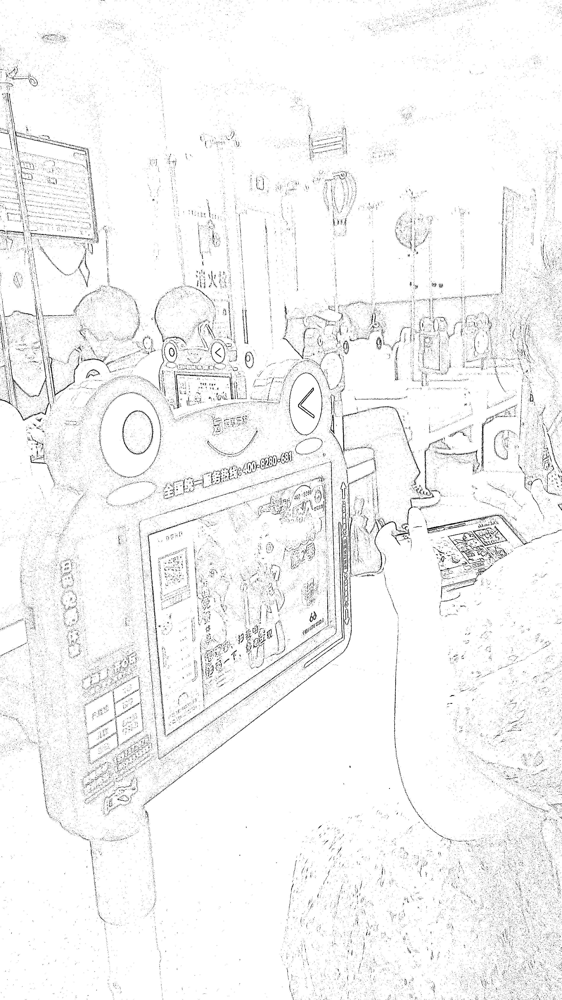

# 儿科医院输液室创新：扫码看动画片让孩子乖乖输液

> 原文：[`www.yuque.com/for_lazy/xkrm14/oil8d4irisrnuohz`](https://www.yuque.com/for_lazy/xkrm14/oil8d4irisrnuohz)

作者： 哆米科技

日期：2023-07-13

点赞数：131

<ne-hole id="u7b9fc669" data-lake-id="u7b9fc669">

正文：

儿科医院输液室的，每个座位一个，很多家长扫码给孩子看动画片，孩子输液就老实多了，有资源的可以搞搞

<ne-hole id="u34a6981e" data-lake-id="u34a6981e">

评论区：

平凡 : 谁想的招啊 太厉害了

哆米科技 : 是啊，太聪明了

云端 : 要是我就直接用手机给孩子看，休想从我这里赚到钱[偷笑][偷笑]

哆米科技 : 手机得一个人一直拿着给孩子看，这个不需要拿着，而且手机可能还要做别的事情，或者没电了之类的

Sunwei : 给大聪明点赞👍

哆米科技 : 主要是被动收益，装好就等着躺赚了[憨笑]想想都好爽啊

在路上 : 使用率不太高

<ne-hole id="uc16da932" data-lake-id="uc16da932">

公众号懒人找资源，懒人专属群分享

</ne-hole></ne-hole></ne-hole>