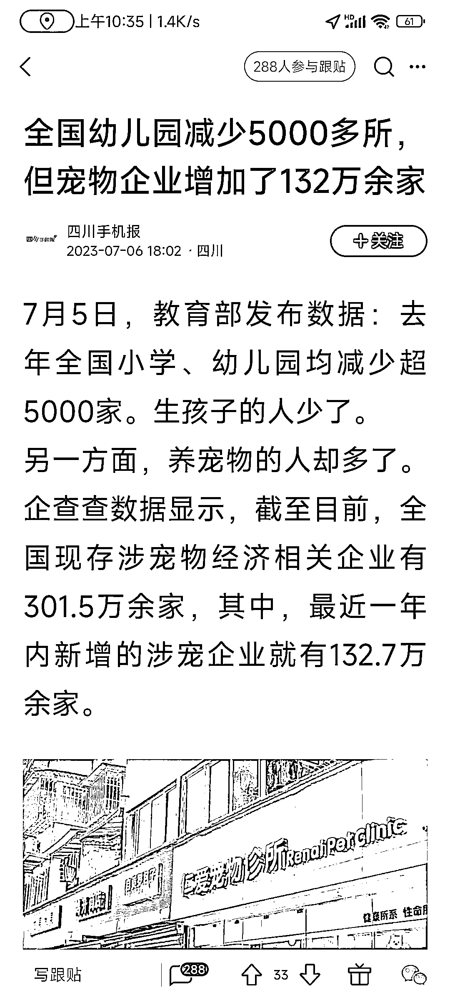

# 宠物市场随着出生率下降而增长

> 原文：[`www.yuque.com/for_lazy/xkrm14/otwpyowoq4bugolr`](https://www.yuque.com/for_lazy/xkrm14/otwpyowoq4bugolr)

<ne-text id="u8f1863c2">作者： 拖鞋先生</ne-text>

<ne-text id="u5000e45e">日期：2023-07-10</ne-text>

<ne-text id="u78391f58">点赞数：</ne-text><ne-text id="ub9107999" ne-bold="true">118</ne-text>

<ne-hole id="ubcc8837c" data-lake-id="ubcc8837c"><ne-card data-card-name="hr" data-card-type="block" id="Qtz4d" data-event-boundary="card">

<ne-text id="u6aa5d8e3">正文：</ne-text>

<ne-text id="u12ff22e6">随着出生率的降低，宠物市场随之增加。</ne-text>

<ne-card data-card-name="image" data-card-type="inline" id="lvj3H" data-event-boundary="card"></ne-card>

<ne-hole id="u4dfee24f" data-lake-id="u4dfee24f"><ne-card data-card-name="hr" data-card-type="block" id="yfopI" data-event-boundary="card">

<ne-text id="uc944ec48">评论区：</ne-text>

<ne-text id="udfb5f6f1">Alex : 恭喜中标[呲牙]</ne-text>

<ne-text id="ue4b3c448">拖鞋先生 : 很突然[偷笑]</ne-text>

<ne-hole id="u17327cf6" data-lake-id="u17327cf6"><ne-card data-card-name="hr" data-card-type="block" id="xN4o9" data-event-boundary="card">

<ne-text id="u8a053636">公众号懒人找资源，懒人专属群分享</ne-text>

</ne-card></ne-hole></ne-card></ne-hole></ne-card></ne-hole>