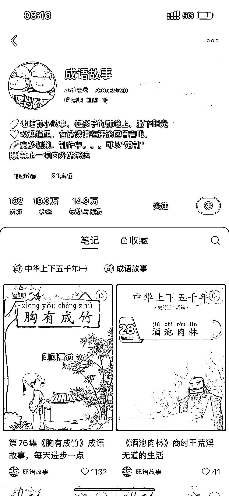
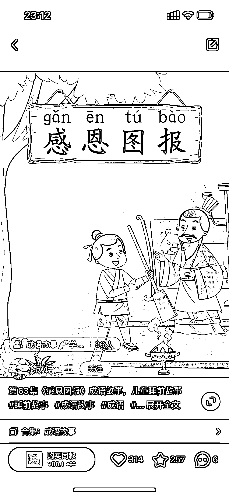

# 利用成语故事书本音频制作视频，在小红书获得 19.3W 粉丝

> 原文：[`www.yuque.com/for_lazy/xkrm14/vyftmpipfnku7lpz`](https://www.yuque.com/for_lazy/xkrm14/vyftmpipfnku7lpz)

作者： Longer

日期：2023-07-11

点赞数：120

<ne-hole id="u5282b2f6" data-lake-id="u5282b2f6"><ne-card data-card-name="hr" data-card-type="block" id="ESFQO" data-event-boundary="card">

正文：

利用成语故事书本有声读物音频，对每个故事用音频转视频的方式制作出来发小红书。 115 个涨粉 19.3 万，橱窗卖 7000（多可能有的博主带）。 可以利用这个思路去制作别的领域视频，或者有视频制作能力的圈友，可以模仿它去其他平台发帖

<ne-card data-card-name="image" data-card-type="inline" id="v4pOM" data-event-boundary="card"></ne-card>

<ne-card data-card-name="image" data-card-type="inline" id="Tn3Ma" data-event-boundary="card"></ne-card>

<ne-card data-card-name="image" data-card-type="inline" id="r5mGe" data-event-boundary="card"></ne-card>

<ne-card data-card-name="image" data-card-type="inline" id="jO4z6" data-event-boundary="card"></ne-card>

<ne-hole id="u0ff01973" data-lake-id="u0ff01973"><ne-card data-card-name="hr" data-card-type="block" id="C6xRm" data-event-boundary="card">

评论区：

叉叉敌 : 这个不错

田书齐 : 请问这是用什么软件制作的视频呢？

Longer : 剪映就可以

田书齐 : 哦啦，万分感谢

牧言木语 : 剪映怎么做呀

<ne-hole id="u66b56602" data-lake-id="u66b56602"><ne-card data-card-name="hr" data-card-type="block" id="BupTT" data-event-boundary="card">

公众号懒人找资源，懒人专属群分享

</ne-card></ne-hole></ne-card></ne-hole></ne-card></ne-hole>