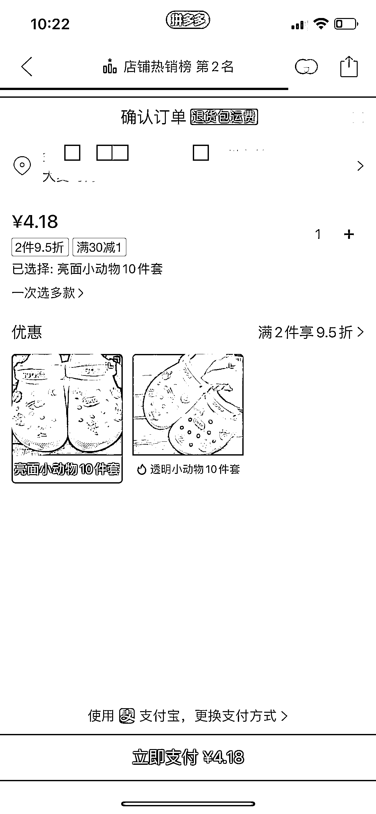

# 百元创业项目，摆摊卖 DIY 洞洞鞋，利润可观

> 原文：[`www.yuque.com/for_lazy/xkrm14/rv9e4h27pav7k96m`](https://www.yuque.com/for_lazy/xkrm14/rv9e4h27pav7k96m)

作者： Tentacion

日期：2023-07-14

点赞数：125

<ne-hole id="u6570195b" data-lake-id="u6570195b"><ne-card data-card-name="hr" data-card-type="block" id="wiQTq" data-event-boundary="card">

正文：

百元创业项目 摆摊卖 DIY 洞洞鞋 选址：商业街，公园等等小孩年轻人比较多的地方 成本：一双洞洞鞋成本不到 5 块，10 个配饰也才 4 块钱，平均一个 4 毛； 变现： 1.直接卖，定价 19，利润率 50%左右； 2.开直播，带货洞洞鞋和配件； 3.生成直播回放，剪出人多的片段，发布视频，把整套流程打包成课程，定价几百没问题； 4.给学员供货，很多不知道在哪拿货的 优势： 1.应季爆品，价格也不贵 2.19 块让小孩体现下 diy 的乐趣很多家长还是愿意的，包括很多年轻人也愿意； 3.sku 不用太多，只选白色，拖鞋的码也比鞋子少，大一码小一码都能穿；运输也方便，一个人就能做起来； 有兴趣的圈友来交流一下

<ne-card data-card-name="image" data-card-type="inline" id="DXAUH" data-event-boundary="card"></ne-card>

<ne-card data-card-name="image" data-card-type="inline" id="TGLMw" data-event-boundary="card"></ne-card>

<ne-card data-card-name="image" data-card-type="inline" id="hcd2z" data-event-boundary="card"></ne-card>

<ne-hole id="uc2ed317a" data-lake-id="uc2ed317a"><ne-card data-card-name="hr" data-card-type="block" id="NIlaF" data-event-boundary="card">

评论区：

大内总管 : 很多年前的布什鞋，crocs

威曹 : sku 比较多，有货源不太合适

小白脸 : 自己创造的，动过手的产品，心理的附加价值就高！

展扬 : 刚看到一篇文章 洞洞鞋在小红书超火。

<ne-hole id="u0c60f556" data-lake-id="u0c60f556"><ne-card data-card-name="hr" data-card-type="block" id="vL2QT" data-event-boundary="card">

公众号懒人找资源，懒人专属群分享

</ne-card></ne-hole></ne-card></ne-hole></ne-card></ne-hole>