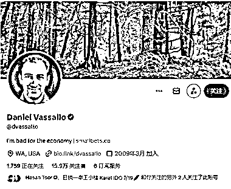

# 自媒体人通过 40 分钟视频课程卖出 170 多万份

> 原文：[`www.yuque.com/for_lazy/xkrm14/vdm656f0p66ibhbq`](https://www.yuque.com/for_lazy/xkrm14/vdm656f0p66ibhbq)

作者： 西昂

日期：2023-07-12

点赞数：99

正文：

1：40 分钟的视频课程，卖了大概 170w 图 1 是作者，图 2 是销售的产品。作者用了 14 个月的时间从 150 粉丝涨到 2.4 万，然后就开始卖课啦~ 卖出 13426 份，平均每份 18 美元，合计人民币 170 多万。 自媒体人出海，就在此刻。[嘿哈]

评论区：

卓凡 : 我的脸书账号总被封

公众号懒人找资源，懒人专属群分享

