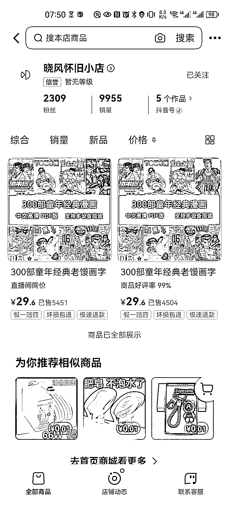

# 销售日本老漫画 PDF，高销量和纯利润，版权风险未知

> 原文：[`www.yuque.com/for_lazy/xkrm14/dgvnywcen21itdgq`](https://www.yuque.com/for_lazy/xkrm14/dgvnywcen21itdgq)

作者： 高超

日期：2023-07-12

点赞数：83

<ne-hole id="u77bf5700" data-lake-id="u77bf5700"><ne-card data-card-name="hr" data-card-type="block" id="ssjS5" data-event-boundary="card">

正文：

卖日本老漫画 pdf 关键词 5 个作品 1w 销量，29.6 的纯利润 不清楚有没有版权风险

<ne-card data-card-name="image" data-card-type="inline" id="qqKAn" data-event-boundary="card">  <ne-hole id="ue918ccdb" data-lake-id="ue918ccdb"><ne-card data-card-name="hr" data-card-type="block" id="ktcWq" data-event-boundary="card"><ne-p id="u12bf327c" data-lake-id="u12bf327c">评论区：

卍 : 这个妥妥侵权行为，淘宝上我也卖过，赚一波快钱没啥问题

毅远 : 抖音现在查盗版的严吗

卍 : 只能说看运气了，胆子大可以以身试法

<ne-hole id="u5f01781d" data-lake-id="u5f01781d"><ne-card data-card-name="hr" data-card-type="block" id="Q0H78" data-event-boundary="card">

公众号懒人找资源，懒人专属群分享

</ne-card></ne-hole></ne-card></ne-hole></ne-card></ne-p></ne-card></ne-hole>