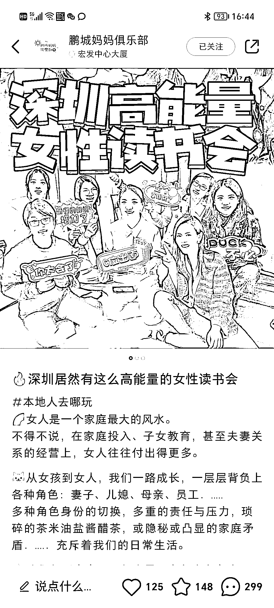

# 女性成长和情绪管理：深挖潜力，多种变现方式

> 原文：[`www.yuque.com/for_lazy/xkrm14/wlh41273guutph4c`](https://www.yuque.com/for_lazy/xkrm14/wlh41273guutph4c)

作者： 豆豆|小张有茶

日期：2023-07-11

点赞数：71

<ne-hole id="u35d67e68" data-lake-id="u35d67e68">

正文：

女性成长、女性情绪管理是可以深挖且很好变现的方向 今天刷小红书，看到这个鹏城妈妈的号，笔记的赞藏、粉丝都不多，但是评伦区相当的活跃，妥妥的精准流量。 读书会、正念冥想、心理/情绪沙龙、茶会、创业/副业、鸡娃交流 这些方向都是相当的香，变现方式也多 1､先赚参与活动的费用 2､卖实物产品 3､卖课程 4､教创业/副业 5､带私教

<ne-hole id="ue1e96873" data-lake-id="ue1e96873">

评论区：

eason. : 有人有跑通的变现吗 本地类似读书会有 5000+私域 但是变现有阻力

榕辰 : 我们跑通了变现，也是线下读书会，可+17709927317 交流

豆豆|小张有茶 : 感谢亦仁[玫瑰]

豆豆|小张有茶 : 我们有组织线下的读书茶会，是通过小范围的读书会来卖茶的

<ne-hole id="u76556418" data-lake-id="u76556418">

公众号懒人找资源，懒人专属群分享

</ne-hole></ne-hole></ne-hole>