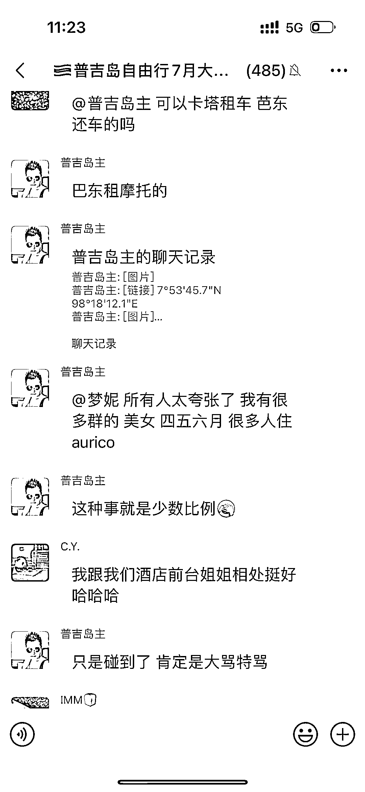
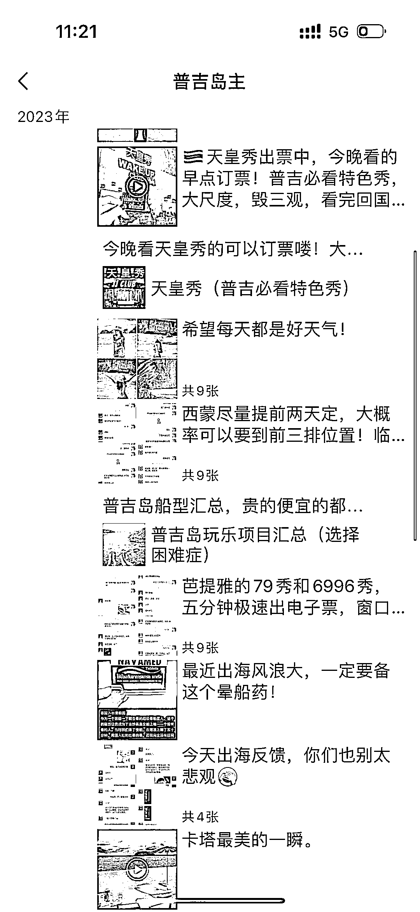

# 普吉岛旅游引流群，每天 100 人进群，消费意向强

> 原文：[`www.yuque.com/for_lazy/xkrm14/na8ahr9q7o36blt9`](https://www.yuque.com/for_lazy/xkrm14/na8ahr9q7o36blt9)

作者： 岂不扯呼。

日期：2023-07-10

点赞数：60

<ne-hole id="ue837a341" data-lake-id="ue837a341">

正文：

旅游引流群 最近要去普吉岛度假，在小红书找攻略的时候发现了一些引流群。群主会在群里热心解答各种问题，增加信任感。群主的朋友圈的主要产品就是各种一日游，包车包船，代订门票。基本上普吉岛的旅游产品线都涵盖了。平均每天能进群 100 人，并且都是消费意向很强的客户。 其他行业也都可以用这个思路试一试。

<ne-hole id="u8c3da983" data-lake-id="u8c3da983">

评论区：

Alex : 恭喜中标[呲牙]

<ne-hole id="u3bc25820" data-lake-id="u3bc25820">

公众号懒人找资源，懒人专属群分享

</ne-hole></ne-hole></ne-hole>