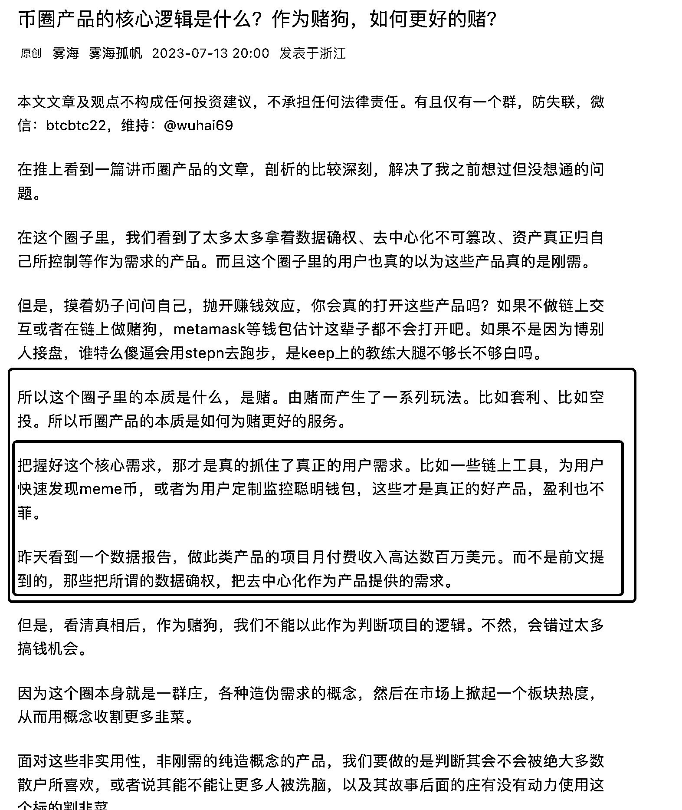

# 卖水的人才是闷声赚大钱的人，币圈产品的核心逻辑是什么？

> 原文：[`www.yuque.com/for_lazy/xkrm14/gnvwnehdqz3wvlzv`](https://www.yuque.com/for_lazy/xkrm14/gnvwnehdqz3wvlzv)

<ne-p id="ubdd2aeb3" data-lake-id="ubdd2aeb3"><ne-text id="u71a32198">作者： 孔孔孔孔孔.</ne-text></ne-p> <ne-p id="u21cd5459" data-lake-id="u21cd5459"><ne-text id="ub54d9f81">日期：2023-07-14</ne-text></ne-p> <ne-p id="ucb4519bc" data-lake-id="ucb4519bc"><ne-text id="u6234d7b6">点赞数：</ne-text><ne-text id="uc952564f" ne-bold="true">66</ne-text></ne-p> <ne-hole id="ub0fa5470" data-lake-id="ub0fa5470"><ne-card data-card-name="hr" data-card-type="block" id="Nc3R7" data-event-boundary="card"><ne-p id="u6ed8ba84" data-lake-id="u6ed8ba84"><ne-text id="uc9145133">正文：</ne-text></ne-p> <ne-p id="u0341cf9d" data-lake-id="u0341cf9d"><ne-text id="u81f31f3c">我一直觉得，卖水的人才是闷声赚大钱的人</ne-text> [<ne-text id="u57785150">币圈产品的核心逻辑是什么？作为赌狗，如何更好的赌？</ne-text>](https://mp.weixin.qq.com/s/Scg_HtuEzBD2TzwQcLmWPg)</ne-p> <ne-p id="u0d44bf45" data-lake-id="u0d44bf45"><ne-card data-card-name="image" data-card-type="inline" id="bYkyU" data-event-boundary="card"></ne-card></ne-p> <ne-hole id="ud1b3afb8" data-lake-id="ud1b3afb8"><ne-card data-card-name="hr" data-card-type="block" id="OCkpJ" data-event-boundary="card"><ne-p id="u4a7fb711" data-lake-id="u4a7fb711"><ne-text id="u271c6ab6">评论区：</ne-text></ne-p> <ne-p id="u35ec05f0" data-lake-id="u35ec05f0"><ne-text id="u6c14f187">鞭炮 : 补充一些数据参考。 Linea 测试网期间，第八周消耗约 30-40 测试水，有些单号买水都得花费 7 刀以上。卖 kyc 的 5-8 刀。</ne-text> <ne-text id="u101caeda">满足撸毛人的需求，赚的估计也不错。</ne-text></ne-p> <ne-p id="u94003829" data-lake-id="u94003829"><ne-text id="ufa5cd149">九京 : 卖水不行啦，现在要教别人卖水。</ne-text></ne-p> <ne-p id="ue9a1a9c9" data-lake-id="ue9a1a9c9"><ne-text id="udc71d597">liong : 简单而深刻的剖析</ne-text></ne-p> <ne-hole id="ua747908f" data-lake-id="ua747908f"><ne-card data-card-name="hr" data-card-type="block" id="GypDy" data-event-boundary="card"><ne-p id="uec090620" data-lake-id="uec090620"><ne-text id="u17d53228">公众号懒人找资源，懒人专属群分享</ne-text></ne-p></ne-card></ne-hole></ne-card></ne-hole></ne-card></ne-hole>