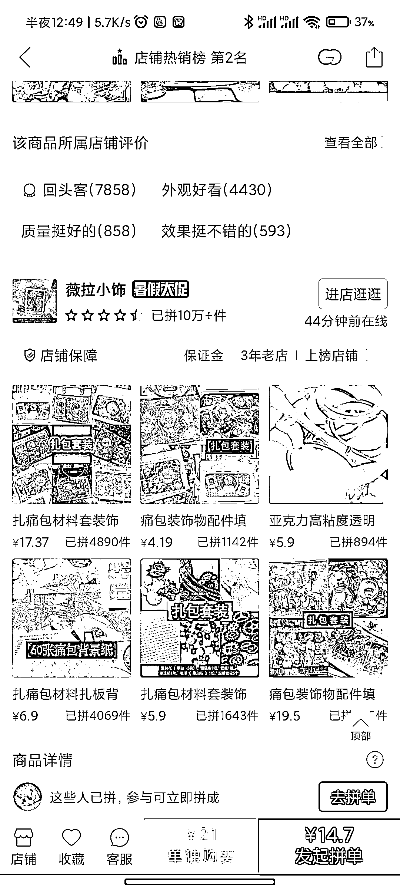
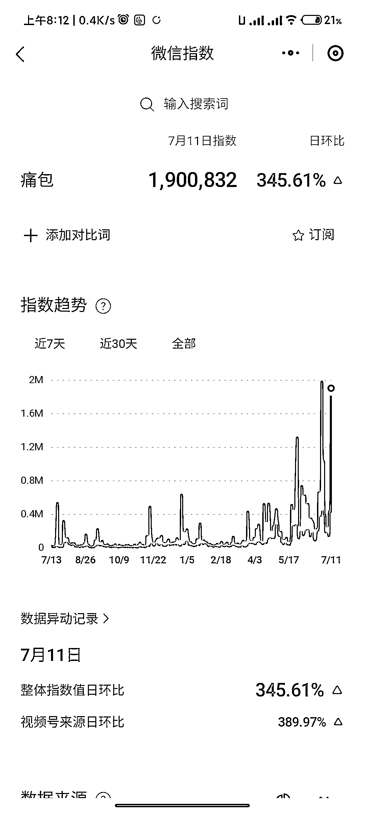

# 零、后的痛文化：痛包成为小众追求的新潮流

> 原文：[`www.yuque.com/for_lazy/xkrm14/go5zfxpo8ggligg8`](https://www.yuque.com/for_lazy/xkrm14/go5zfxpo8ggligg8)

<ne-text id="uf967ae6a">作者： 落落</ne-text>

<ne-text id="u8432955a">日期：2023-07-13</ne-text>

<ne-text id="u438f792a">点赞数：</ne-text><ne-text id="u1f251ad9" ne-bold="true">63</ne-text>

<ne-hole id="u99880b1c" data-lake-id="u99880b1c"><ne-card data-card-name="hr" data-card-type="block" id="VZIqG" data-event-boundary="card">

<ne-text id="uf23c3b68">正文：</ne-text>

<ne-text id="u612fbe1f">00 后的痛文化：小众的痛包 痛文化属于泛二次元，除了痛包，还有痛车之类的，主打一个奇怪夸张。 痛包(itabag)是指挂满动漫人物徽章和玩偶</ne-text> <ne-text id="u2998b67e">包包，因为这样的包会让人感觉“奇怪和夸张 (注:日语的“痛”有此含义)”，所以被称为“痛包(itabag)”。也是在粉丝群中表达自己喜爱的人物的一种方式。</ne-text>

<ne-card data-card-name="image" data-card-type="inline" id="IaVz4" data-event-boundary="card"></ne-card>

<ne-card data-card-name="image" data-card-type="inline" id="pzn2y" data-event-boundary="card"></ne-card>

<ne-card data-card-name="image" data-card-type="inline" id="C2lZ0" data-event-boundary="card"></ne-card>

<ne-card data-card-name="image" data-card-type="inline" id="LG3h0" data-event-boundary="card"></ne-card>

<ne-card data-card-name="image" data-card-type="inline" id="Onblj" data-event-boundary="card"></ne-card>

<ne-hole id="u1d6e39f7" data-lake-id="u1d6e39f7"><ne-card data-card-name="hr" data-card-type="block" id="kIFaV" data-event-boundary="card">

<ne-text id="u3cffe67c">评论区：</ne-text>

<ne-text id="uf924ba90">胖大魔 : 长见识了</ne-text>

<ne-text id="u261b5f1a">落落 : Thanks!</ne-text>

<ne-text id="u38430d8d">落落 : 我也是意外发现的，确实很小众</ne-text>

<ne-text id="u95f9704b">胖大魔 : 二次元里的亚文化[呲牙]</ne-text>

<ne-hole id="ubea9d52e" data-lake-id="ubea9d52e"><ne-card data-card-name="hr" data-card-type="block" id="Kc2z9" data-event-boundary="card">

<ne-text id="uaca3904d">公众号懒人找资源，懒人专属群分享</ne-text>

</ne-card></ne-hole></ne-card></ne-hole></ne-card></ne-hole>