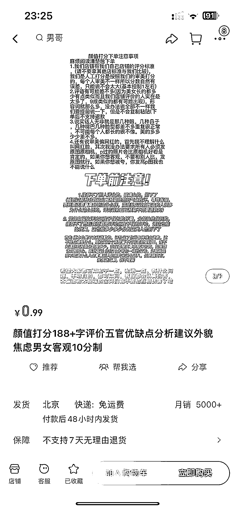
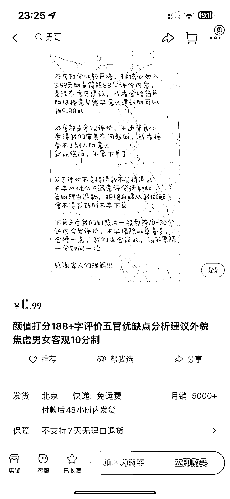

# 淘宝评分和评语是否由软件自动生成？

> 原文：[`www.yuque.com/for_lazy/xkrm14/gfn5th4xxty006gw`](https://www.yuque.com/for_lazy/xkrm14/gfn5th4xxty006gw)

作者： 佛山无影脚

日期：2023-07-10

点赞数：59

<ne-hole id="u9d7f4245" data-lake-id="u9d7f4245">

正文：

淘宝给人样子打分，一个月销量 5000+，评分和评语是有什么软件自动生成的吗？

<ne-hole id="uc728282d" data-lake-id="uc728282d">

评论区：

大谢.₂₀₁7 : 掌握各个器官的描述，那就是填空题，再加上 GPT，岂不美哉

<ne-hole id="u428897bb" data-lake-id="u428897bb">

公众号懒人找资源，懒人专属群分享

</ne-hole></ne-hole></ne-hole>