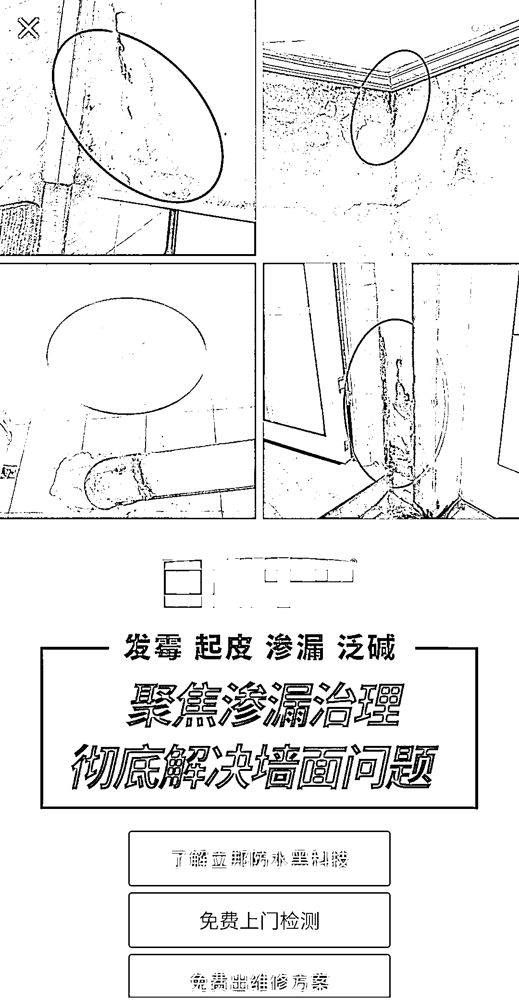

# 防水市场潜力巨大，短视频引流是不可错过的机会

> 原文：[`www.yuque.com/for_lazy/xkrm14/dimfevosslz4xzhe`](https://www.yuque.com/for_lazy/xkrm14/dimfevosslz4xzhe)

<ne-p id="u9cf80777" data-lake-id="u9cf80777"><ne-text id="u42657ab7">作者： 楚川</ne-text></ne-p> <ne-p id="ue4d9d759" data-lake-id="ue4d9d759"><ne-text id="u00f4eb11">日期：2023-07-10</ne-text></ne-p> <ne-p id="u433d81c2" data-lake-id="u433d81c2"><ne-text id="u07a24998">点赞数：</ne-text><ne-text id="uef7ebc8e" ne-bold="true">56</ne-text></ne-p> <ne-hole id="u7b1127cd" data-lake-id="u7b1127cd"><ne-card data-card-name="hr" data-card-type="block" id="CiN7l" data-event-boundary="card"><ne-p id="u631357f9" data-lake-id="u631357f9"><ne-text id="u9a991837">正文：</ne-text></ne-p> <ne-p id="u0183fa21" data-lake-id="u0183fa21"><ne-text id="u03434099">防水市场是值得做的，就用短视频引流。跟投资人确认了一下，这个行业特点:中国未来的房子基本上要重新做一遍防水；防水市场老师傅多，用户也被连续教育过，市场成熟；防水客单价高，利润空间高；区域可以做到品牌壁垒。不做可惜了的行业。</ne-text></ne-p> <ne-p id="uc6225dbf" data-lake-id="uc6225dbf"><ne-card data-card-name="image" data-card-type="inline" id="DsbgW" data-event-boundary="card"></ne-card></ne-p> <ne-hole id="ubd1e6471" data-lake-id="ubd1e6471"><ne-card data-card-name="hr" data-card-type="block" id="dbOmp" data-event-boundary="card"><ne-p id="uac14a988" data-lake-id="uac14a988"><ne-text id="ua7dc5341">评论区：</ne-text></ne-p> <ne-p id="u35d5ebfd" data-lake-id="u35d5ebfd"><ne-text id="u7397bfe6">郭小帅 : 大行业，小企业，防水行业集中度低，CR3 不超过 25%，但是总体行业产能过剩，集中度缓慢提升中</ne-text></ne-p> <ne-p id="u9db4ace4" data-lake-id="u9db4ace4"><ne-text id="uef1a34ee">楚川 : 对，没有激发的窗口</ne-text></ne-p> <ne-p id="ua2efd2be" data-lake-id="ua2efd2be"><ne-text id="ud80659f0">大勇非勇 : 确实有一类需求是这样的：出问题时就是刚性硬需，没问题的时候压根就无视。</ne-text></ne-p> <ne-hole id="u73eb0e71" data-lake-id="u73eb0e71"><ne-card data-card-name="hr" data-card-type="block" id="qJ7a8" data-event-boundary="card"><ne-p id="uea86e447" data-lake-id="uea86e447"><ne-text id="ud72e0314">公众号懒人找资源，懒人专属群分享</ne-text></ne-p></ne-card></ne-hole></ne-card></ne-hole></ne-card></ne-hole>