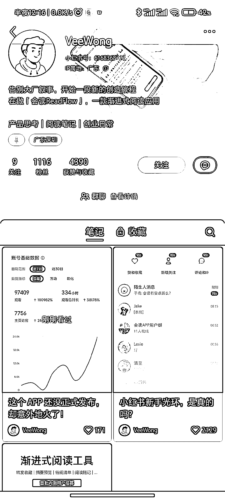

# 「会读」APP 招募内测用户，功能亮点包括摘要预览和自定义导读

> 原文：[`www.yuque.com/for_lazy/xkrm14/pa0ynfrgziqtlr8g`](https://www.yuque.com/for_lazy/xkrm14/pa0ynfrgziqtlr8g)

<ne-text id="u40af7ca6">作者： 落落</ne-text>

<ne-text id="u8c35b412">日期：2023-07-13</ne-text>

<ne-text id="uf66822c2">点赞数：</ne-text><ne-text id="ue965e23f" ne-bold="true">59</ne-text>

<ne-hole id="u4043f544" data-lake-id="u4043f544"><ne-card data-card-name="hr" data-card-type="block" id="JktQA" data-event-boundary="card">

<ne-text id="ubb2507f0">正文：</ne-text>

<ne-text id="u7bec4f30">「会读」APP 在小红书做冷启动，招募内测用户。 早在 5 月份已经有圈友分享过 会读收藏助手，把文章链接转给它，可以自动生成文章摘要。 今天刷到 APP</ne-text> <ne-text id="ufabbd7f3">创始人在小红书招募内测用户，近一个月只发了 3 篇笔记，内测群聊里有 1000 多人。 做 APP 冷启动的，可以借鉴。 三个让我眼前一亮的功能：</ne-text> <ne-text id="u636a3c44">1️⃣摘要预览 转发过来的文章内容，会读助手将自动生成摘要预览，可在会话(或 APP)中快速完成略读，或进行精读筛选。 2️⃣自定义导读</ne-text> <ne-text id="ue10690bc">可根据个人阅读习惯和需要，进行摘要内容的自定义组合，包括:一句话概述、文章要点、关联问题等内容 3️⃣同步 flomo</ne-text> <ne-text id="uc17bd3e8">可将[笔记+标签+原文链接]同步至你的 flomo</ne-text>

<ne-card data-card-name="image" data-card-type="inline" id="NIaN4" data-event-boundary="card"></ne-card>

<ne-card data-card-name="image" data-card-type="inline" id="MUri4" data-event-boundary="card"></ne-card>

<ne-card data-card-name="image" data-card-type="inline" id="ThpyG" data-event-boundary="card"></ne-card>

<ne-hole id="ubbfd0cf5" data-lake-id="ubbfd0cf5"><ne-card data-card-name="hr" data-card-type="block" id="RpvpI" data-event-boundary="card">

<ne-text id="u84121eb3">评论区：</ne-text>

<ne-text id="u3013bf66">落落 : 谢谢</ne-text>

<ne-text id="u9002e208">冰雨幻天 : 我也在内侧群</ne-text>

<ne-text id="u00dc4ff4">落落 : 我没在[偷笑]</ne-text>

<ne-text id="u4c88e18b">bgz 洲洲 : 可以用这个功能做三分钟读一本书类似的内容号</ne-text>

<ne-text id="u8e14bfdf">落落 : 确实啊，思路很👍</ne-text>

<ne-text id="ueaefd23b">eason. : 1.2 有 gpt 不是解决了</ne-text>

<ne-text id="u30d67625">落落 : 是呀，但是 gpt 对很多人来说都是门槛，而且用起来不方便</ne-text>

<ne-hole id="u46e16ea9" data-lake-id="u46e16ea9"><ne-card data-card-name="hr" data-card-type="block" id="Z5bKB" data-event-boundary="card">

<ne-text id="ub01696cb">公众号懒人找资源，懒人专属群分享</ne-text>

</ne-card></ne-hole></ne-card></ne-hole></ne-card></ne-hole>