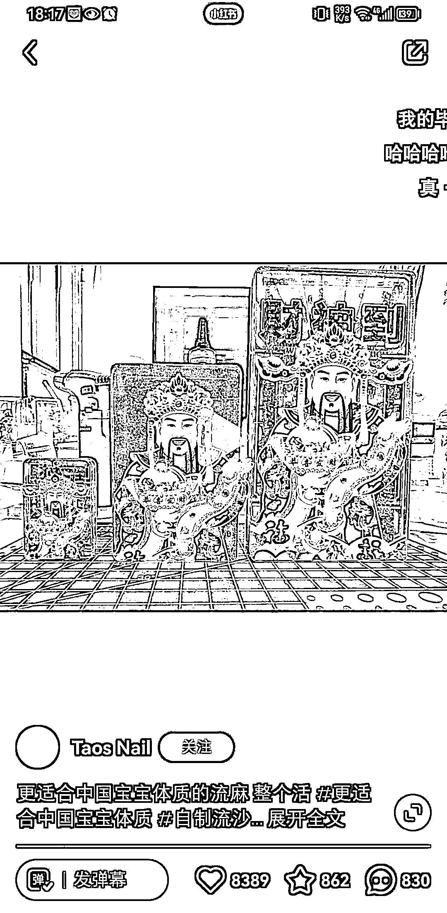

# 二次元工艺品“财神立牌”引发跨界购买热潮

> 原文：[`www.yuque.com/for_lazy/xkrm14/kroez6gs4qgmbzmn`](https://www.yuque.com/for_lazy/xkrm14/kroez6gs4qgmbzmn)

作者： 波本零

日期：2023-07-10

点赞数：48

<ne-hole id="ue00b4fac" data-lake-id="ue00b4fac"><ne-card data-card-name="hr" data-card-type="block" id="ANrYH" data-event-boundary="card">

正文：

二次元圈子的人比较喜欢玩吧唧、亚克力流沙这类可以做周边的工艺品，而现在有玩家率先“破圈”做成了财神立牌，立马吸引了不玩二次元用户的注意力去购买。有玩这个圈子的圈友可以多挖掘一下，1688 打样保底是 100 起步。

<ne-card data-card-name="image" data-card-type="inline" id="r6h0Q" data-event-boundary="card"></ne-card>

<ne-card data-card-name="image" data-card-type="inline" id="aIpTA" data-event-boundary="card"></ne-card>

<ne-card data-card-name="image" data-card-type="inline" id="X9Ijj" data-event-boundary="card"></ne-card>

<ne-card data-card-name="image" data-card-type="inline" id="Ub177" data-event-boundary="card"></ne-card>

<ne-hole id="u8881d795" data-lake-id="u8881d795"><ne-card data-card-name="hr" data-card-type="block" id="SgkRA" data-event-boundary="card">

评论区：

Alex : 恭喜中标[呲牙]

<ne-hole id="ue2af3eba" data-lake-id="ue2af3eba"><ne-card data-card-name="hr" data-card-type="block" id="mbdDI" data-event-boundary="card">

公众号懒人找资源，懒人专属群分享

</ne-card></ne-hole></ne-card></ne-hole></ne-card></ne-hole>