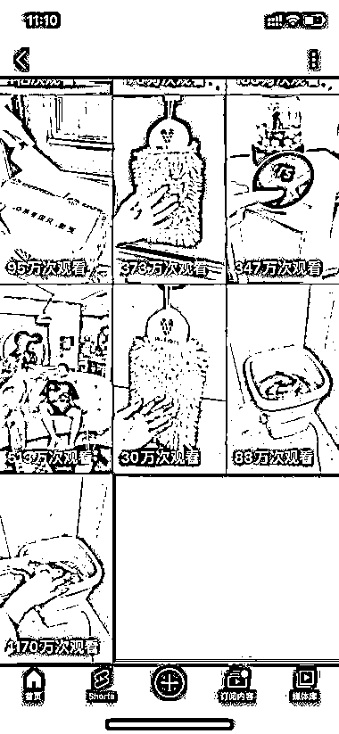
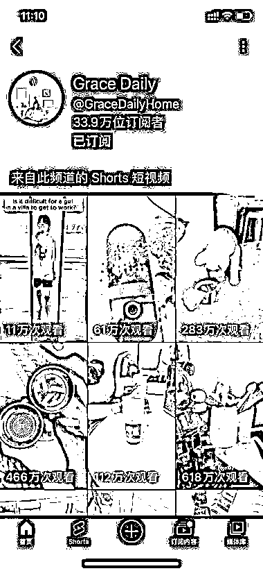
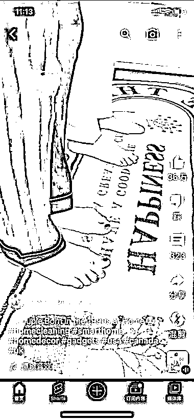

# Youtube 好物号 19 个视频流量破亿，独立站引流带货效果显著

> 原文：[`www.yuque.com/for_lazy/xkrm14/mbkhkr7w1xrgk2gf`](https://www.yuque.com/for_lazy/xkrm14/mbkhkr7w1xrgk2gf)

作者： 大仙

日期：2023-07-10

点赞数：85

正文：

【油管好物号 19 个视频流量破亿 引流独立站带货】油管短视频 Shorts 可以直接搬运抖音快手短视频，特别是好物带货视频，这个号运营两个月，发了 19 个视频，总播放量有 1.4 亿，每条播放量都是几十万上百万，评论区自己置顶独立站的链接进行引流带货，产品主要偏向家居产品类，视频偏向没有说话的，可以加上英文就可以直接发，产品价格起码比国内高 8-10 倍，利润可观。

  

  

评论区：

啊明 : 你搬运上去试试就知道了，原创还有可能性……

鲁西西 : 不好做了吗

一笑 : 这个是不是也有类似豆荚的付费投放加持。纯靠免费自然流应该拿不到这么多流量吧？

大仙 : 看另外这个油管的好物号，去年开始运营的，一个短视频观看量 6.3 亿，这个号也是搬运的。异常值！

公众号懒人找资源，懒人专属群分享

