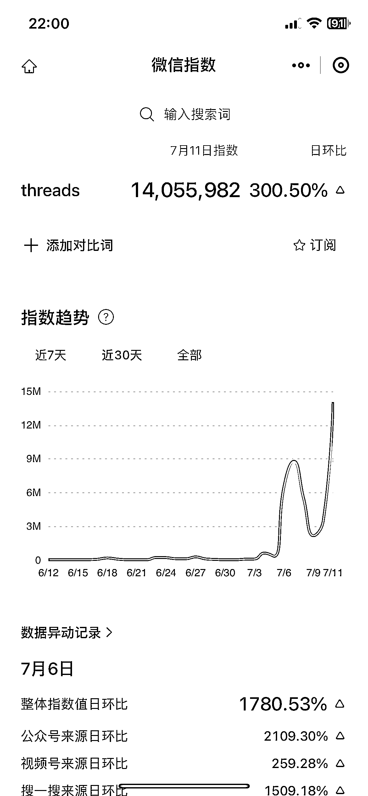
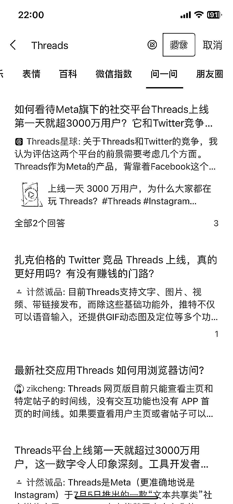

# Threads 上线 5 天用户过亿，引发热潮

> 原文：[`www.yuque.com/for_lazy/xkrm14/dhg053edb3se593t`](https://www.yuque.com/for_lazy/xkrm14/dhg053edb3se593t)

作者： 大宝

日期：2023-07-12

点赞数：59

<ne-hole id="u4172f759" data-lake-id="u4172f759"><ne-card data-card-name="hr" data-card-type="block" id="e7vgF" data-event-boundary="card">

正文：

Threads 上线 5 天用户过亿，这几天我看 Threads 的热度非常大，用户增速已经超过 ChatGPT，微信上已经有公众号和视频号在蹭 Threads 的流量了，淘宝上也有卖 Threads 的安装包，圈友们可以思考下围绕 Threads 能不能挖掘出一些小众需求，比如前段时间圈友 分享的精华帖围绕 Spotify 挖掘出小众蓝海需求，我们可以多思考一下

<ne-card data-card-name="image" data-card-type="inline" id="CI7xX" data-event-boundary="card"></ne-card>

<ne-card data-card-name="image" data-card-type="inline" id="Sd6BM" data-event-boundary="card"></ne-card>

<ne-card data-card-name="image" data-card-type="inline" id="vgoDy" data-event-boundary="card"></ne-card>

<ne-card data-card-name="image" data-card-type="inline" id="Z2XX9" data-event-boundary="card"></ne-card>

<ne-hole id="u5201cdd9" data-lake-id="u5201cdd9"><ne-card data-card-name="hr" data-card-type="block" id="HQG84" data-event-boundary="card">

评论区：

陆霖好汉 : 公众号名称带 threads 的，图标是他 logo 的全部被判违规了，要认证才行。这也算个小门槛

<ne-hole id="u9073774b" data-lake-id="u9073774b"><ne-card data-card-name="hr" data-card-type="block" id="jqmbw" data-event-boundary="card">

公众号懒人找资源，懒人专属群分享

</ne-card></ne-hole></ne-card></ne-hole></ne-card></ne-hole>