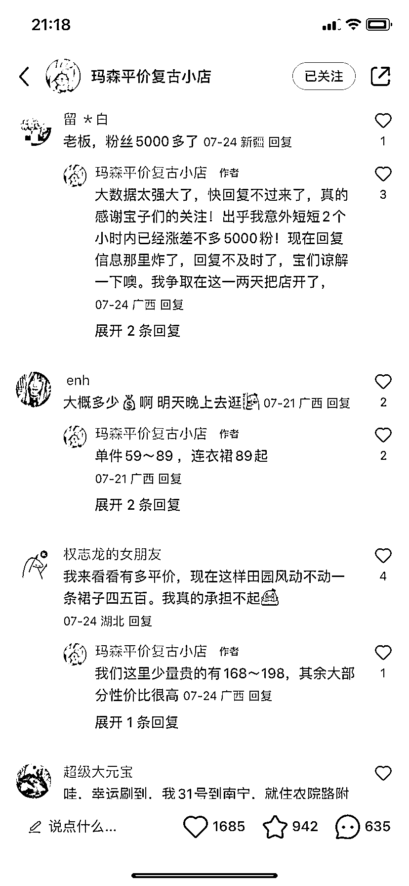
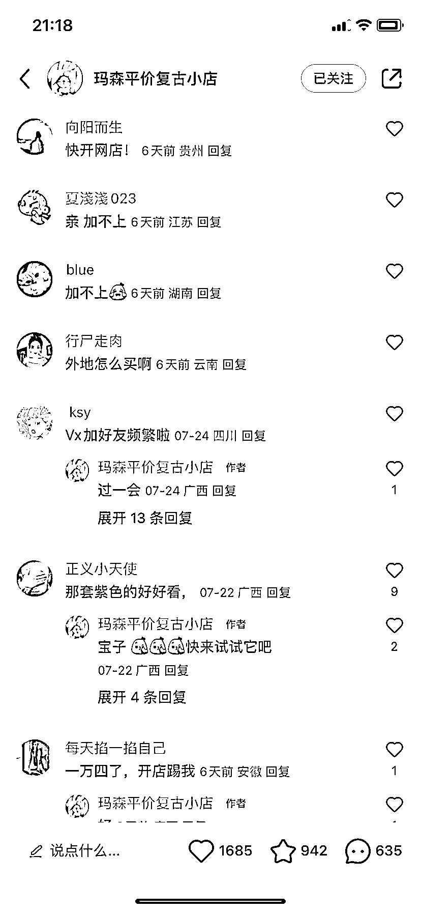
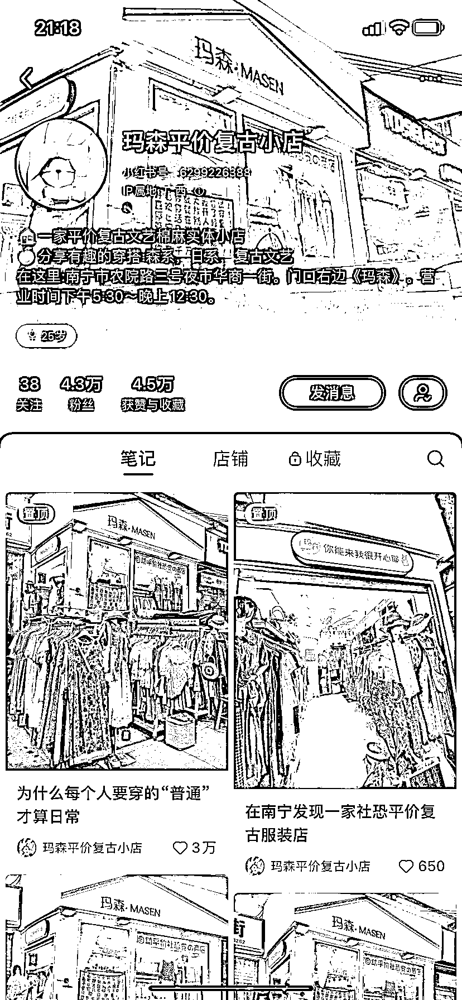

# 小红书卖女装，突破地域限制，开辟新市场

> 原文：[`www.yuque.com/for_lazy/xkrm14/itg6ghxafdizcn3k`](https://www.yuque.com/for_lazy/xkrm14/itg6ghxafdizcn3k)

作者： lily fu🌟符

日期：2023-08-01

点赞数：113

正文：

小红书卖女装，主打社恐、宅女人群，低价多款，线下搬线上，打破地域局限，但是打开了市场新大陆

  

  

  

  

  

评论区：

坏孩（大学生） : 这种店男孩子也想进去逛一下😂

小隐 : 反手转发给开服装店的表姐～

帅帅🔫🌱 : 这家我也看到了，怎么没想到发个风向标[偷笑]

进哥哥 : 有个问题，给线下店引流是可以理解的，但是如果是线上购买，通过私域发图下单？

lily fu🌟符 : 开了线上店铺哦

