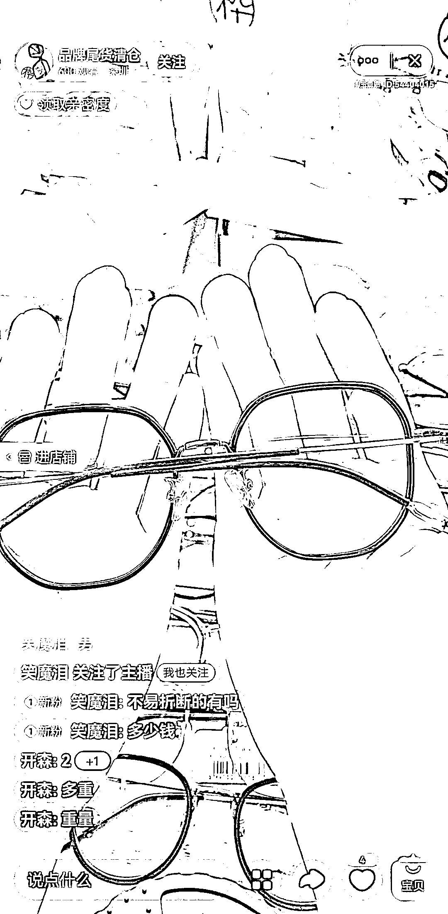
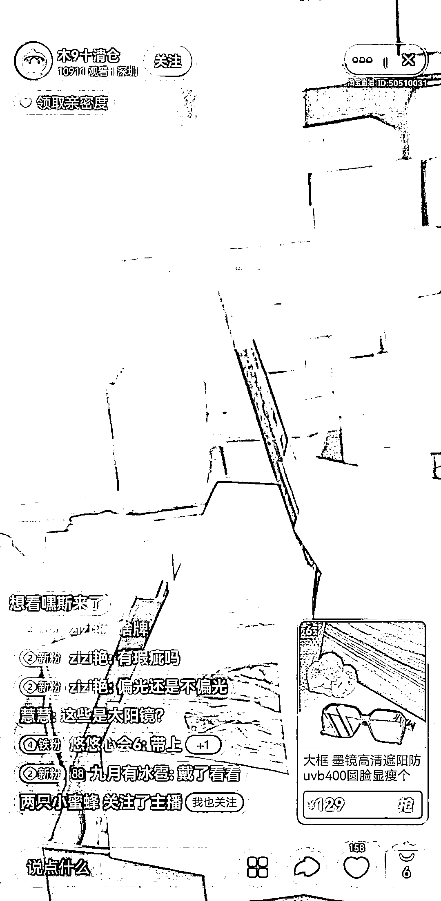
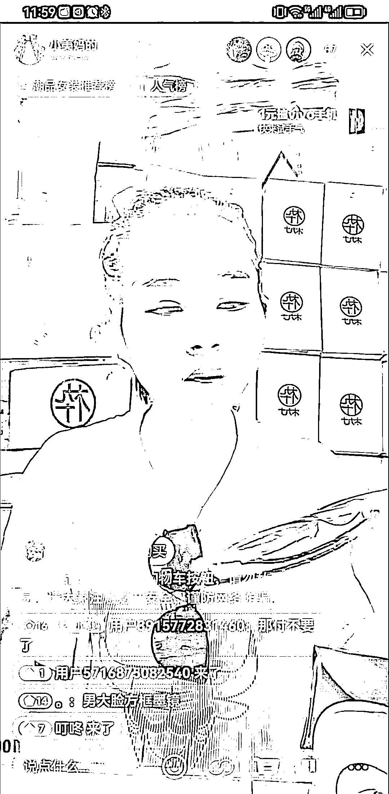

# 眼镜品牌尾货清仓，淘宝直播带货日销 200 多单

> 原文：[`www.yuque.com/for_lazy/xkrm14/nd29q8es6tr690ph`](https://www.yuque.com/for_lazy/xkrm14/nd29q8es6tr690ph)

作者： 杜胜国

日期：2023-08-02

点赞数：111

正文：

分享一个身边的真实案例项目，眼镜品牌尾货清仓。六月底入驻淘宝直播，都是新 c 店，不用刷单，就直播一个月时间干到眼镜品类直播带货第一。日销 200 多单，客单均价在 100 左右，毛利在 6-7 成。 这个尾货项目是货带人，对主播一点要求不高，只要说话利索一点都可以播，是人就可以播。 目前太阳镜还有三个月的红利期，到十月以后就不好卖了，但是还有光学眼镜一直可以卖，配镜利润高。目前品牌尾货走的很厉害的就是木九十品牌。 有资源有时间的宝子可以干起来，百分百挣钱。淘宝抖音都有红利。别问我为什么知道这么多，因为我准备干的，调研很清楚了，因为有优先级比较高事情所有自己不干了，分享给圈友利他[害羞]。 同理，有资源的可以把这个模式扩展到其他品类，比如服装，食品，玩具，目前都有成功案例。

  

  

  

评论区：

坏孩（大学生） : 厉害

lydia : 货源去哪找[吃瓜]

北沐 : 我的木九十 2000 块钱买的。。。

懒猫 lazy : 我就在直播间买了一个[偷笑]

