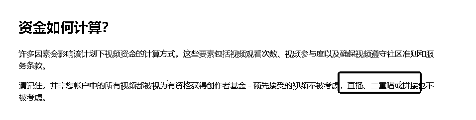
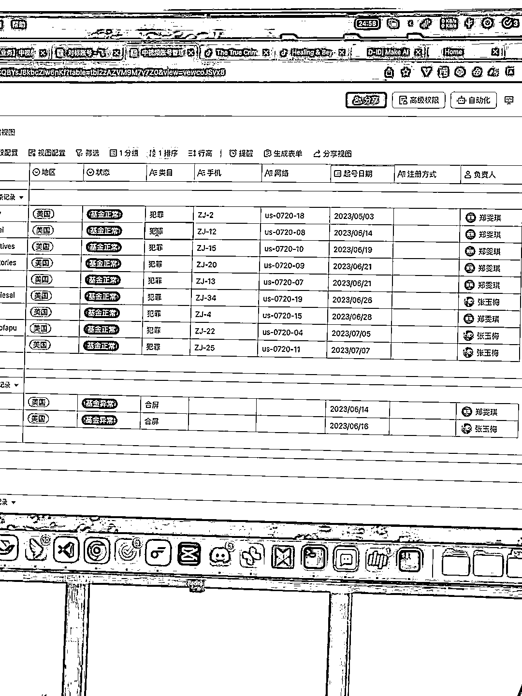

# TikTok 视频政策调整，合拍账号无法提现，建议做原创内容

> 原文：[`www.yuque.com/for_lazy/xkrm14/cdffoei7akiicetg`](https://www.yuque.com/for_lazy/xkrm14/cdffoei7akiicetg)

作者： 丛政

日期：2023-08-04

点赞数：75

正文：

Tiktok 中视频政策调整 tiktok 中视频我们团队测试了两个月，收益还可以，但是最近流量比较好的合拍账号都出现无法提现的情况，中视频是按播放量算收益，官方说的是每一千播放 0.8-1 美金，实际每一万播放收益在 5 美金左右，大家看下图 1 的政策，主流合拍的方式行不通了，目前建议做原创内容，因为中视频是每月 15 号提现，1 号结算收益。做过创作者基金的可以赶紧入场，周期估计 2-3 个月比较好做。

  

评论区：

丛政 : 💐

舒 : 合拍是什么样的形式？

丛政 : 合拍就是合屏，比如左边画面是自己的，右边是其他博主的，正常搬运的内容用合拍也算原创，现在不算了，审核的时候提不了现

舒 : 好的，谢谢哈

星夜 : tk 中视频计划开通 有什么要求吗

小陶 : 1 万粉 30 天内 10 万播放量 满 18 岁

星夜 : 僵尸粉可以不😃

公众号懒人找资源，懒人专属群分享

