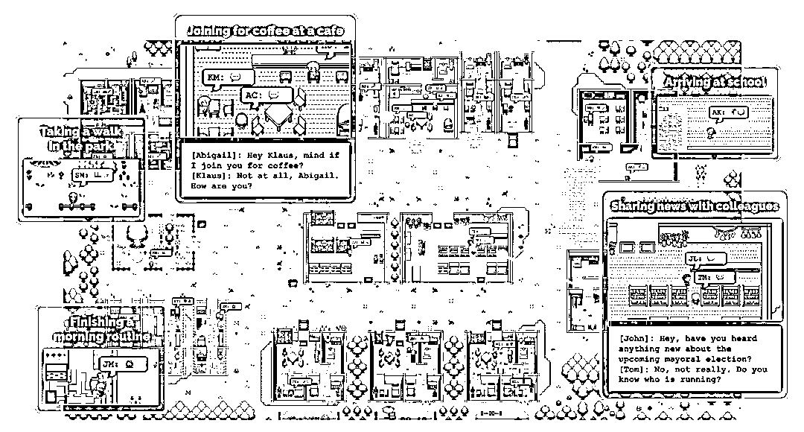

# 斯坦福超人前传开源，探索 AI 特工在数字世界的生活

> 原文：[`www.yuque.com/for_lazy/xkrm14/gg3x6zuawnpogqv5`](https://www.yuque.com/for_lazy/xkrm14/gg3x6zuawnpogqv5)

作者： 元峰

日期：2023-08-10

点赞数：63

正文：

著名的斯坦福超人前传正式开源！ 25 个 AI 特工居住在数字西部世界，不知道他们生活在模拟中。他们去上班，八卦，组织社交，结交新朋友，甚至坠入爱河。 每个人都有独特的个性和背景故事。 Smallville 是 2023 年最鼓舞人心的 AI 代理实验之一。我们经常谈论单个 LLM 的涌现能力，但多智能体涌现的规模可能更加复杂和迷人。 一群人工智能可以演绎整个文明的进化。 未来将有无限的新可能性。游戏将首先感受到这种影响。 Github: Paper: Authors: @joon_s_pk @joseph_c_obrien @carriejcai @merrierm @percyliang @msbernst GitHub+-+joonspk- research/generative_agents:+Gener... research/generative_agents)[[2304.03442]+Generative+Agents:+Interactive+Simula...](https://arxiv.org/abs/2304.03442)

评论区：

公众号懒人找资源，懒人专属群分享

