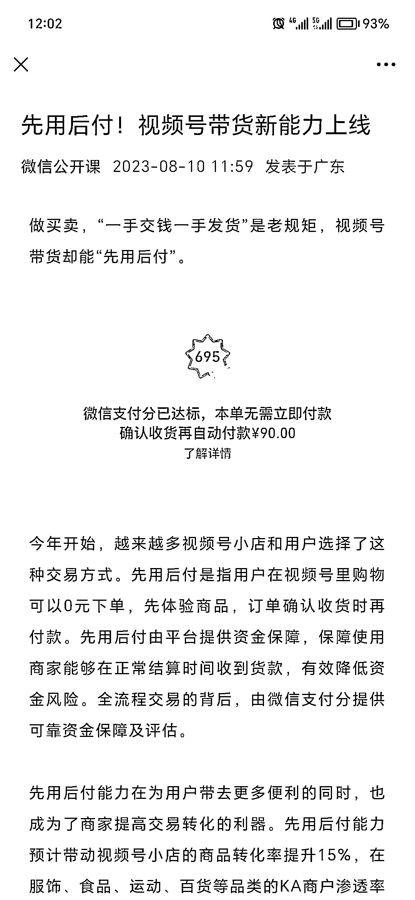

# 视频号带货新功能上线

> 原文：[`www.yuque.com/for_lazy/xkrm14/authpg9u0oaayuzy`](https://www.yuque.com/for_lazy/xkrm14/authpg9u0oaayuzy)

作者： 追风

日期：2023-08-10

点赞数：73

正文：

先用后付，视频号新功能上线。 对视频号卖货是利好，这下在视频号上买东西更加丝滑了。 [先用后付！视频号带货新能力上线](https://mp.weixin.qq.com/s/8b_8XcoX-1qsoJp8jWXOzQ)

评论区：

张红月 : 退货率上升多少～

天花板讲武德 : 这个问题绝大数应该取决于你的产品问题吧[发呆]

张红月 : 不完全是 这个机制会有很大一批人买多件商品回来 然后只保留一件 其他退掉 将买东西之前的对比决策放在了后面 和之前唯品会一样 当然质量好的到哪都不怕比 但对大部分商家来说需要权衡和 ROI 换算测验

猫爸 : 太多的买家是这样操作了

