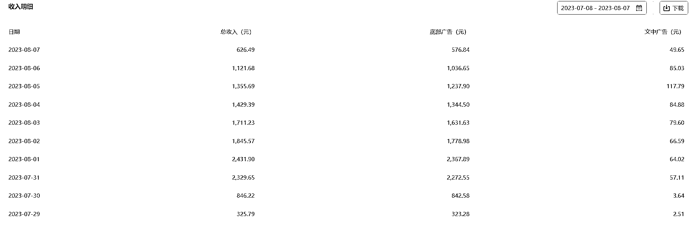

# 微信公众号文章意外蹭热点，阅读量达 218 万，收益超过 1 万

> 原文：[`www.yuque.com/for_lazy/xkrm14/kxg0zu5u3ldnv465`](https://www.yuque.com/for_lazy/xkrm14/kxg0zu5u3ldnv465)

作者： 万能的星星 i

日期：2023-08-08

点赞数：146

正文：

微信公众号 7.24 号发了一篇文章，意外蹭到了热点，文章在三四天之后开始涨阅读，截止到目前阅读已经 218 万，单篇收益 1 万➕。如果对热点有提前预知的能力，说明在公众号也可以提前布置内容，看有没有机会被公众号推流，一旦推流这个流量是非常大的。

评论区：

老船长李阳 : 很真诚的分享

郑鹏鑫 : [强]

清风 : 可以的[强]

万能的星星 i : [抱拳]

万能的星星 i : [抱拳]

万能的星星 i : [抱拳]

胖大魔 : 我八卦王觉得我可以[害羞]

梦汐 : 发的啥内容啊[尴尬]

公众号懒人找资源，懒人专属群分享

