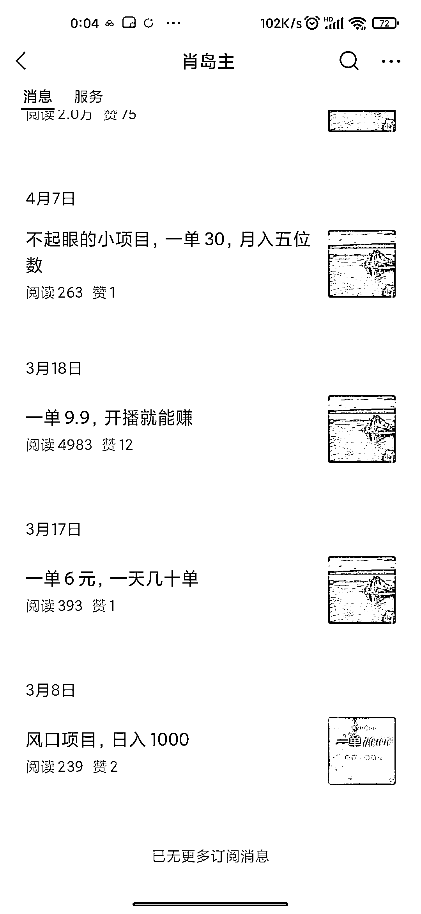
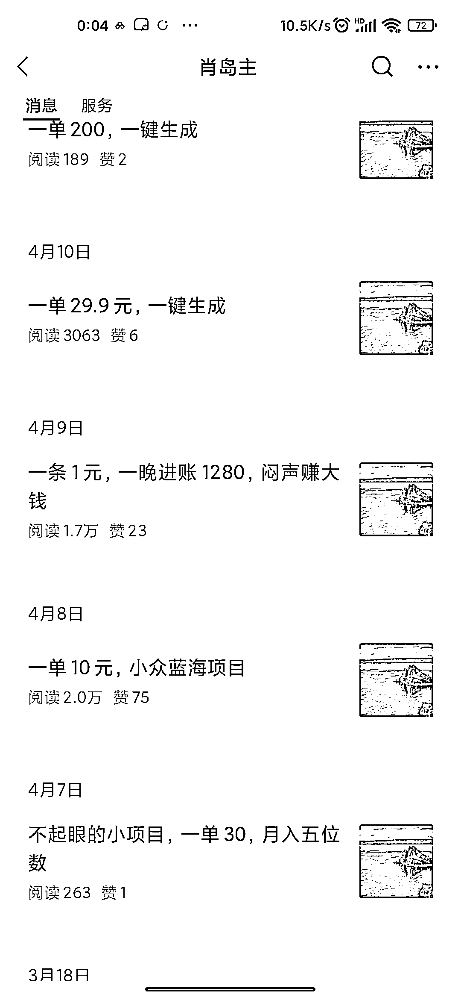
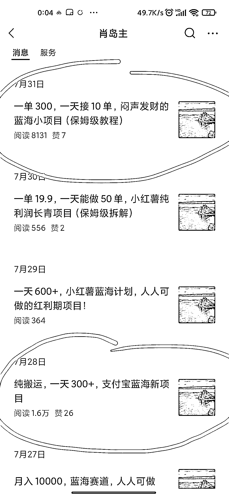

# 腾讯动作频频，公众号成为创业者新宠

> 原文：[`www.yuque.com/for_lazy/xkrm14/ftlyrzt5h6slo5bs`](https://www.yuque.com/for_lazy/xkrm14/ftlyrzt5h6slo5bs)

作者： 阿道

日期：2023-08-09

点赞数：131

正文：

写项目拆解，创业类的公众号，今年 3 月 8 号才开始写的第一条，应该是新号，3 月 18 号就入池了，而且是高培训的，流量主那些收益可能都看不上。 今年以来，腾讯动作很多，公众号越来越容易入池获取推荐流量了。而公众号又是文字打造 IP 最适合的工具，借助微信，视频号，公众号一条龙无缝衔接。公众号大家一定要重视起来。

  

  

评论区：

阿道 : 又中标一条风向标[呲牙][呲牙][呲牙]

南斋读书 : 这个流量不错了，引流不少人

阿道 : 算很大了

公众号懒人找资源，懒人专属群分享

