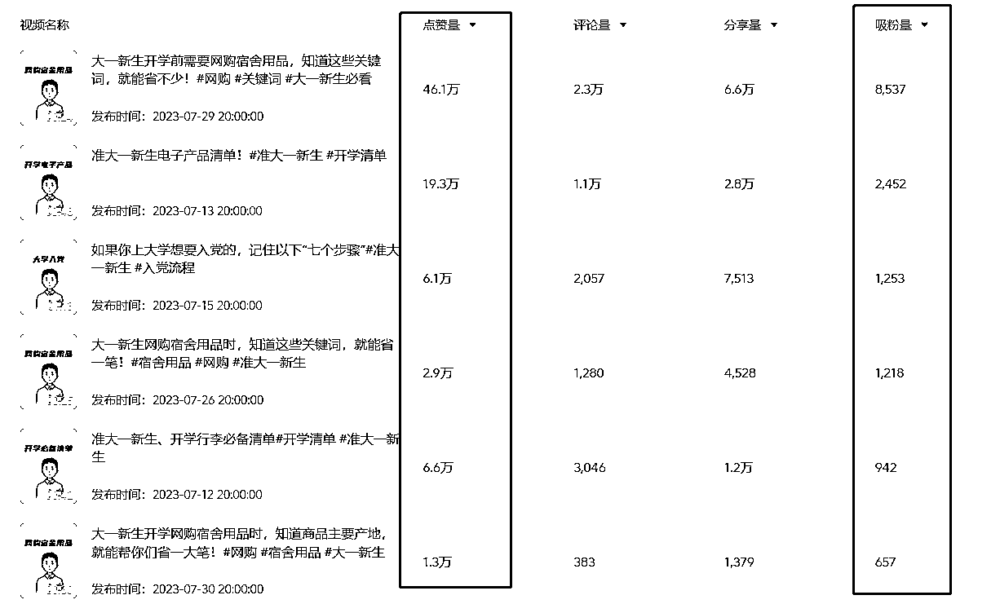
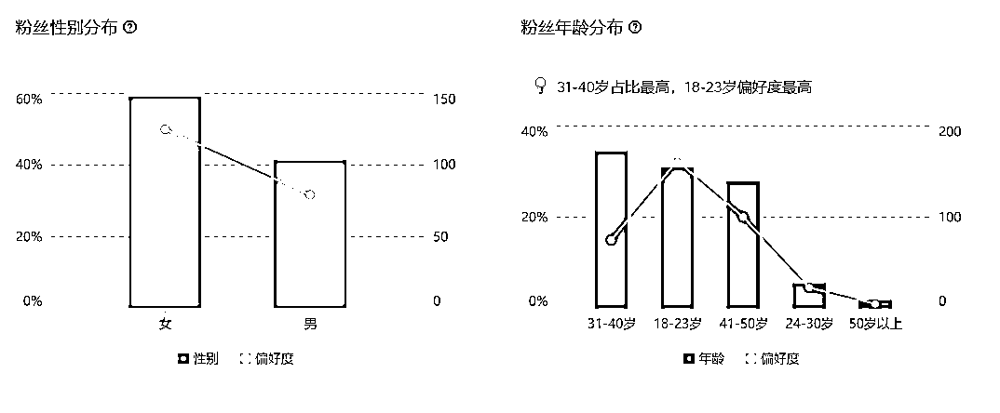

# 抖音新号靠开学清单吸引 5w 活宝妈粉丝

> 原文：[`www.yuque.com/for_lazy/xkrm14/nu3vqhxas2ui1vh9`](https://www.yuque.com/for_lazy/xkrm14/nu3vqhxas2ui1vh9)

作者： Believer

日期：2023-08-08

点赞数：122

正文：

一个抖音新号，刚起没多久达到 5w 粉 内容是开学清单，这没啥稀奇的 稀奇的是他完全靠一个选题，一个内容涨到这个粉丝量，如图一 而且吸引的也并不是低价值的色粉、男粉、老头粉，而是活的宝妈粉！！如图二 暑假也过去一半了，开学清单这个选题也该爆发了，想起号的赶紧了

评论区：

小白脸 : 抓住需求

星辰 : 咦，不错啊，最近我在小红书也老看到这个。开学清单很容易爆文

🍧（搞钱版） : 请教一下这个是用什么网站分析的？

Believer : 抖音热点宝

