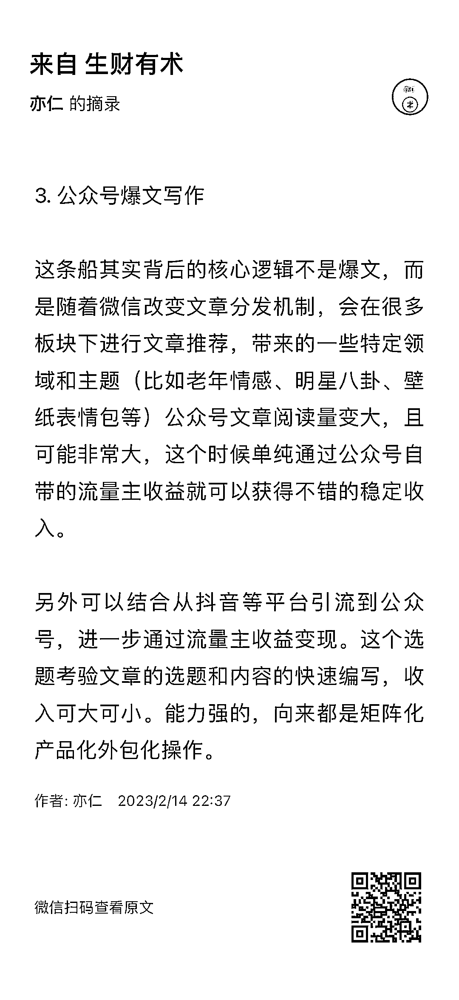

# 抓住了更本质层面的东西，你就知道哪些事是一定要做好

> 原文：[`www.yuque.com/for_lazy/xkrm14/sqq42fape2wcp84o`](https://www.yuque.com/for_lazy/xkrm14/sqq42fape2wcp84o)

作者： 亦仁

日期：2023-08-07

点赞数：649

正文：

看图，兑现一下半年前吹的牛逼，半年后来看，全都验证。 最近看见一些一个月赚几十万的公众号流量主收益案例出来， 里面也有一些案例，我还挺佩服当时自己的判断力，毕竟那个时候几乎没人觉得这是一个很好的机会。 上次 也问我，为什么觉得这是个机会？他感觉这不就是一波流吗？ 我跟他说，你看到的一些具体的爆文方法会失效，确实是，方法一定会失效，你觉得这是很短期的事情，所以你不敢投入，而我看到的是平台间流量的迁移。 变的是方法，而相当长一段时间不会变的是：微信重新进行流量分配拯救文字生态的决心，那是非常巨大的流量变化。 抓住了更本质层面的东西，你就知道哪些事是一定要做好，而哪些事，就随他去吧。

评论区：

时行一 : 亦仁老大的认知真是高，能站在平台的高度看到我们看不到的东西[强][强][强]

Dreamland : 亦仁大佬的认知是真高[偷笑] 我是靠一个做公众号情感文的朋友告诉我的[发呆] 因为她自己不靠 ai 写就能挣钱，然后发现了有人用 ai 做，她不会做，但是她知道我会做，因为我是主动链接她的，然后才发现那个机会，后面实操之后才出现了爆款[得意]

奶茶 : 哎呀，老板厉害👍🏻

家蒙 : 疯狂点赞，太佩服了

家蒙 : 优秀

Dreamland : 那没有的，还是要多帮别人，这样说不定对方有个好机会，就会告诉你

元气锦鲤😍😍 : 大佬，您用的是哪个 ai

云珞 YunL : 太厉害了

