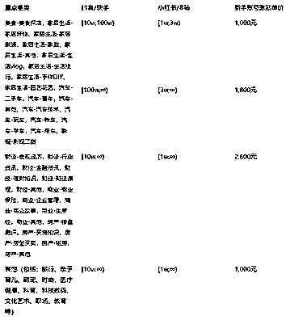
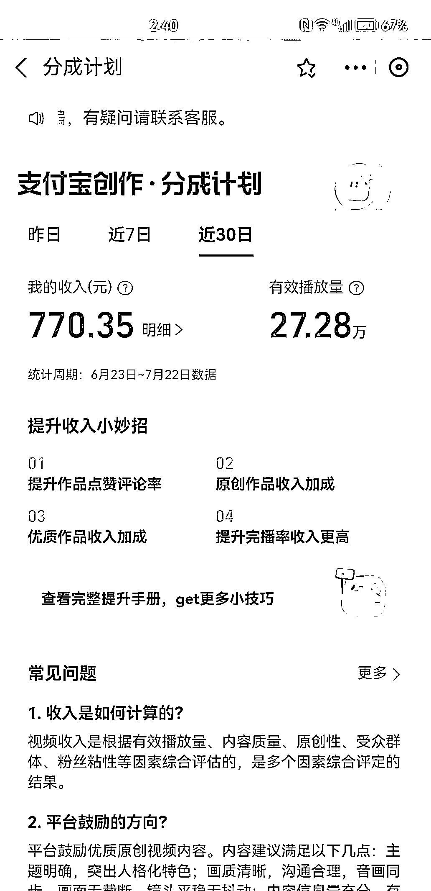
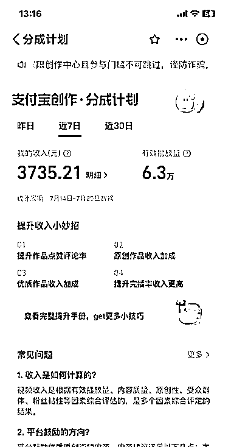
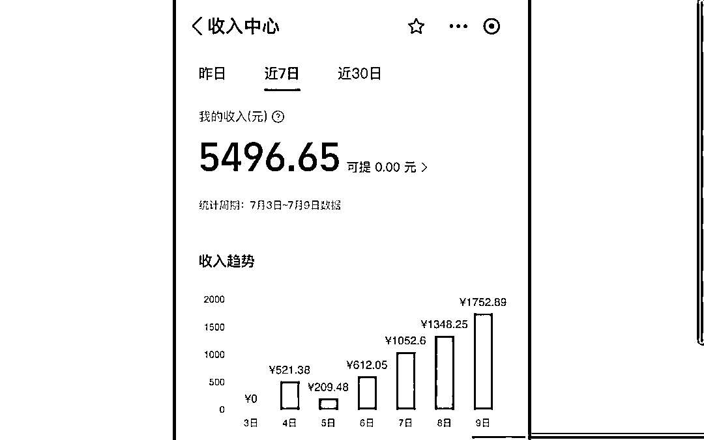
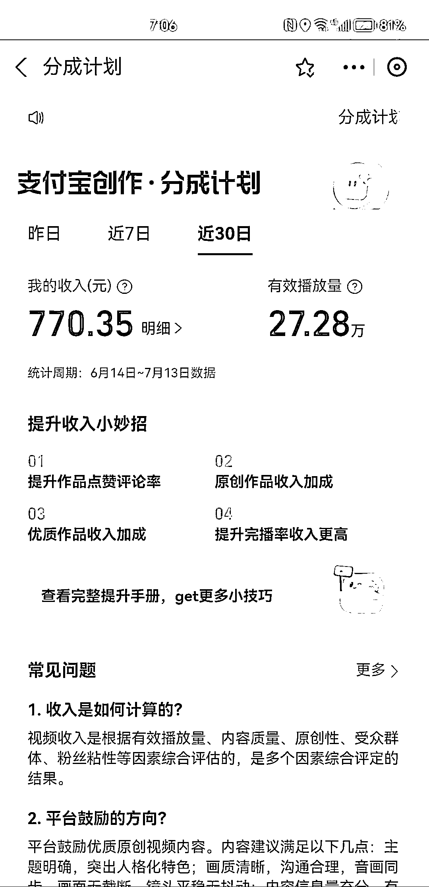

# 支付宝分成玩法总结

> 原文：[`www.yuque.com/for_lazy/xkrm14/wbuy4gt16s47hc0n`](https://www.yuque.com/for_lazy/xkrm14/wbuy4gt16s47hc0n)

作者： 子白

日期：2023-08-11

点赞数：146

正文：

支付宝分成玩法总结： 感谢白丁老师的倾情分享 先做内容，把画风过了，最后解决 100 活跃粉丝的事，当你的画风过了其实 100 活跃粉丝也够了，不要互刷，都是无效粉丝，别听抖音营销号瞎扯，他们都是没有做出结果的，就蹭个热点。 我们倾向于做二创或者原创，好处是可以拿到高单价和持续做，符合平台要求，做搬运迟早会被嘎掉。 封面不要有黑边、模糊，内容方面就按中视频的要求，加配音解说，视频画面与文案相关即可，分辨率 720P 以上。 财经和探店是重点扶持领域，已经在做财经和探店的博主一定要入驻。 对于做内容的，我们推荐做探店、美食、好物推荐、手工制作 、萌宠、科普、家居生活 、三农、数码科技、育儿、旅行、汽车，这些领域都是符合支付宝生活号的内容调性。 必须注重封面，发布内容记得用电脑发布，可自定义封面（s.alipay.com）。画质 720P 以上，模糊的视频会被判非优质内容，取消分成计划。 通过分成计划后也不要批量搬运或制作垃圾视频，平台会巡检，内容低质就会降单价甚至取消分成。 最后建议大家平常心，支付宝生活号用户现在不多，发出去的视频两位数播放已经算多了，心态要佛系，万一爆一个的收入很可观，近期明显感觉到出爆文比以前多了，视频的播放量也在上升，所以稳住持续干，现在是跑马圈地，占个坑等待爆发。

评论区：

毛豆 : 6 万播放量，收益 3700？这单价放眼全球，即便不是最高，也接近最高了吧

子白 : 收益奇高，播放奇低

娜娜 : 支付宝目前估计玩的人少，适合小白入局吗

子白 : 可以入局占坑

沙滩螃蟹 : 好像是需要个体工商资质

希平 : 个体户 9.9 元搞一个

