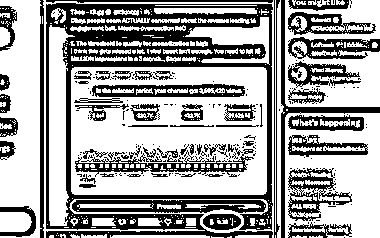

# 查看推文估计价值的方法

> 原文：[`www.yuque.com/for_lazy/xkrm14/mi1qg0paz7u085qg`](https://www.yuque.com/for_lazy/xkrm14/mi1qg0paz7u085qg)

作者： 元峰

日期：2023-08-11

点赞数：68

正文：

X 最近发送了数百万美元的创作者支出。 但是，想知道你的推文的价值吗？ 以下是查看推文估计价值的方法： 使用 PayCheck for Twitter 的 Chrome 扩展程序，用于估算每个帖子的广告收入。 [[https://chrome.google.com/webstore/detail/paycheck](https://chrome.google.com/webstore/detail/paycheck)... ]([https://chrome.google.com/webstore/detail/paycheck-for-](https://chrome.google.com/webstore/detail/paycheck-for-)twitter/ldgffedhocinnolmaaecnppdfmmofilp)

  

  

评论区：

