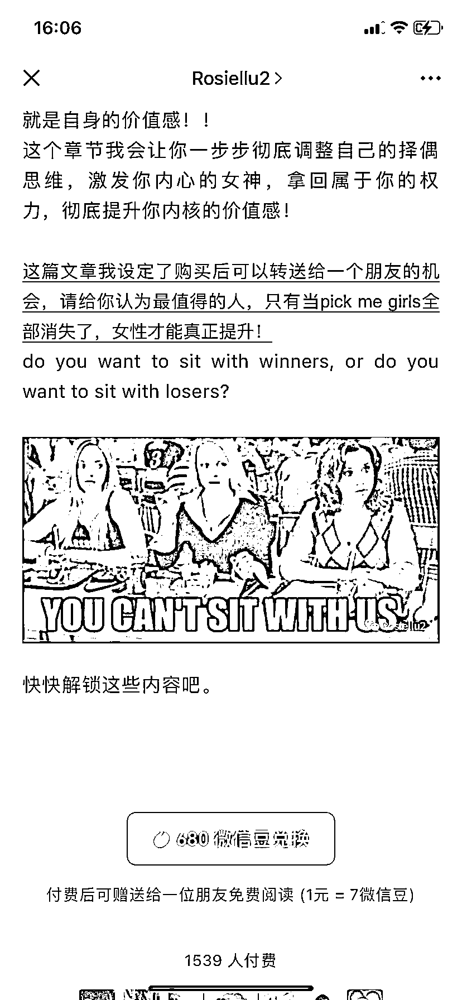

# 公众号高单价付费阅读，婚恋市场女性焦虑成为赚钱风向标

> 原文：[`www.yuque.com/for_lazy/xkrm14/xgw5vvztexqdb8cq`](https://www.yuque.com/for_lazy/xkrm14/xgw5vvztexqdb8cq)

作者： 美妙人生

日期：2023-08-14

点赞数：84

正文：

公众号高单价付费阅读，内容是上嫁类型，单篇付费将近 100 元每人，看下面这个数据，基本上一篇收入就将近 10 万，博主一个月发 2-4 篇，月入 20 万-40 万。婚恋市场女性焦虑感高且有付费能力和高意愿。

评论区：

朱朱侠 : 除了这种方式，还有其他的方式可以满足这一部分焦虑的女性吗？

詹伟平 : 参考情感咨询变现

Alex : 🎉🎉🎉

鸡蛋面 : b 站近 20 万份，大部分粉丝是从 b 站过来的

