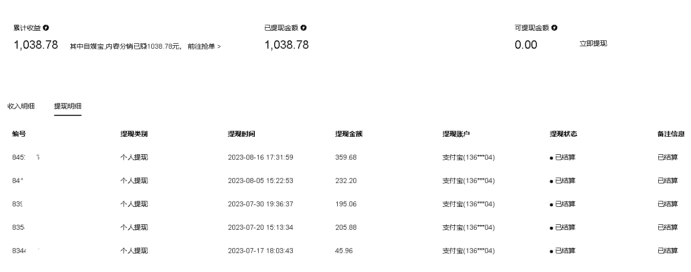

# 公众号接单平台，简单操作，一个月变现一千块钱

> 原文：[`www.yuque.com/for_lazy/xkrm14/pmddthesznar4mug`](https://www.yuque.com/for_lazy/xkrm14/pmddthesznar4mug)

作者： 子云师兄

日期：2023-08-17

点赞数：74

正文：

在公众号接单平台，一个月总数接了五单，变现一千来块钱 （实则是每天都有单可以接，但是不想一直发广告） 有能力的小伙伴可以多注册点账号，找公众号流量主平台，多接点广告 操作方面是非常简单的 注册认证之后，找到合适的广告同步到公众号，直接发布即可

评论区：

子云师兄 : 一个阅读量在 0.2-0.8 块之间，自己选择 社群和朋友圈人多的，可以直接发一下私域 只要跟预估阅读量差距不是很夸张，就不会影响到结算 想扩大就自己多开几个公众号，养一下，再去接单

谈谈心 : 都是垃圾广告

子云师兄 : 要学会选适合自己公众号类目的

平凡小吴 : 新榜的吗

子云师兄 : 新榜的

南斋读书 : 现在不是让走互选平台吗？

子云师兄 : 还是一样的可以走三方变现

公众号懒人找资源，懒人专属群分享

