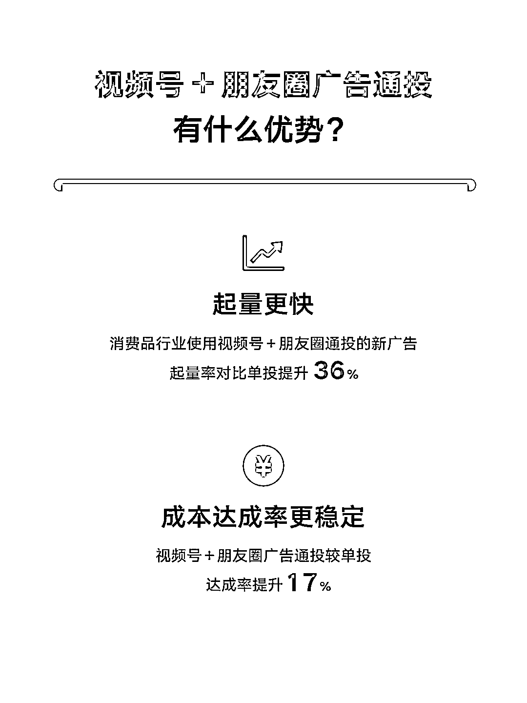
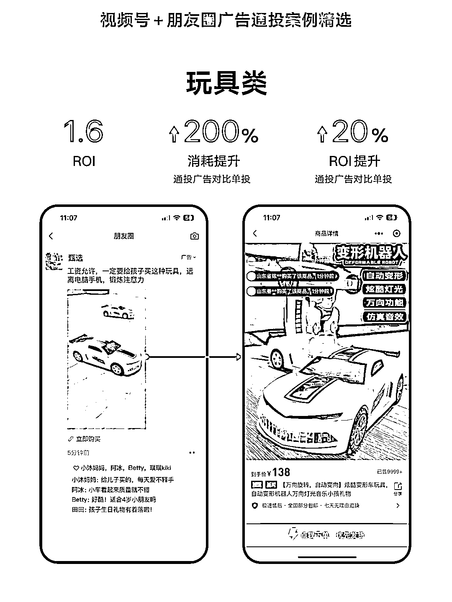

# 微信付费投流，视频号+朋友圈广告通投，消费品行业案例精选

> 原文：[`www.yuque.com/for_lazy/xkrm14/cume272igpqi0ep9`](https://www.yuque.com/for_lazy/xkrm14/cume272igpqi0ep9)

作者： 不期而遇

日期：2023-08-16

点赞数：65

正文：

微信付费投流，朋友圈+视频号投放，这个路径开放太牛了！！！ 微信广告助手 视频号 + 朋友圈广告通投消费品行业案例精选 消费品行业广告主通过视频号 + 朋友圈广告通投收获更好投放表现： ✨ 起量更快 通投在多流量版位同时积累数据，从而加速广告起量，消费品行业使用视频号 + 朋友圈通投的新广告起量率对比单投提升 36%。 ✨ 成本达成率更稳定 通过全流量复用通投数据样本，通投广告 oCPX 成本达成更稳定，视频号 + 朋友圈广告通投较单投达成率提升 17%。 💡 投放小技巧 • 在投放管理平台的【广告版位】-【按媒体选择】部分，圈选包含“朋友圈 + 微信视频号”在内的多个广告版位，即可开启通投。 • 根据产品特点适当放宽年龄等定向，扩大用户覆盖。 • 使用爆量素材 + 突出卖点文案，提升用户点击意愿。 • 落地页突出产品卖点和细节高清图，配合优惠信息，促进用户下单。 8 月正值暑假档期，用户活跃度高，整体流量库存更加充足，竞争环境相对宽松，建议广告主把握高性价比拿量机会进行增投，最大化投放效果。

评论区：

不期而遇 : 谢谢亦仁

辉哥 : 系统全部打通确实厉害，很有想象空间，不知道有没有测试的，效果如何？

