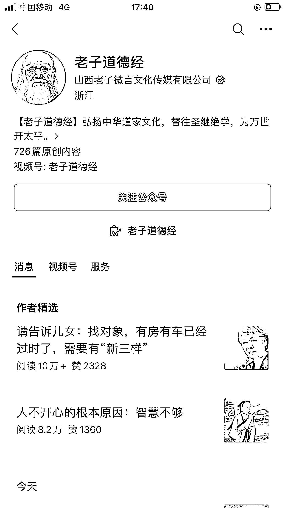
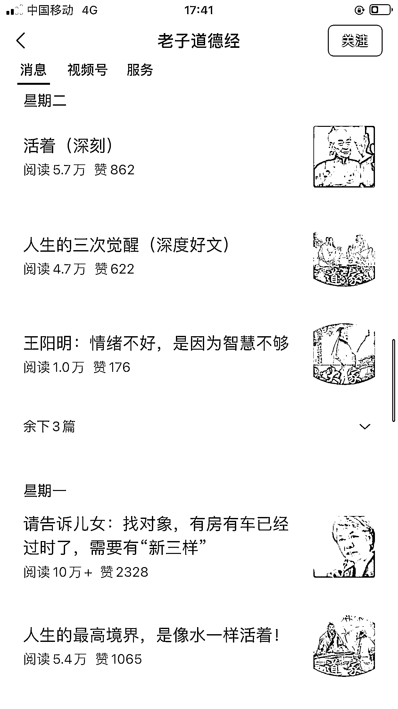

# 中老年自媒体市场潜力巨大，传统文化鸡汤号成为爆文写作方向

> 原文：[`www.yuque.com/for_lazy/xkrm14/eehe0h2hyt73mg86`](https://www.yuque.com/for_lazy/xkrm14/eehe0h2hyt73mg86)

作者： 林元陸

日期：2023-08-18

点赞数：209

正文：

建议有意向参与公众号爆文写作的圈友，都来好好了解一下这个公众号。下午刚刷到的这个公众号名字叫“老子道德经”，最近这些天数据很不错，10 万+的都不知一篇了。 看了下推文确实有不少是与道家有关的观点文，不过像是四大名著、唐诗宋词之类的古代文学、传统文化有关的文章也是有发布。 如果要在 8 月航海上车公众号爆文写作，那么以传统文化为内核的鸡汤号确实是一个很好的方向。因为这类账号主要受众多是中老年人，他们的心理特征是追求安稳度过余生，希望自己无病无灾，主打一个“平安是福”。 值得一提的是中老年（尤其是老年人）的消费能力确实是不容小觑的：2022 年 1 月，银发人群在淘宝的月活跃用户规模同比增长 43.3%，在拼多多的月活跃用户规模同比增长 31.8%，在京东和淘特的月活跃用户规模同比增长分别是 50.3%和 109.3%，由此可见，老年人网络消费群体规模均呈快速增长趋势！ 总而言之，随着我国人口加速老龄化，相信这种以中老年群体为主要受众的自媒体也会有更大的市场。

评论区：

青空明月 : 感谢分享，很有帮助[玫瑰]

不记年 : 做了这个类目的，但是爆了几篇后流量很快就没了[捂脸][捂脸]

林元陸 : 另起一篇，展开讲讲

叶西楚 : 这个号粉丝体量很大吧，很久前就看到这个号了，它主体下有不少号

林元陸 : 你的说法是对的，而且我相信这个号的发展历程是有经验可以借鉴的。

猴哥 : 这个账号的用户体量很大，我上周就挖掘到过，不当做对标账号

林元陸 : 既然你不同意当对标账号来看，那你觉得，银发读者这个市场蛋糕，够大吗？

公众号懒人找资源，懒人专属群分享

