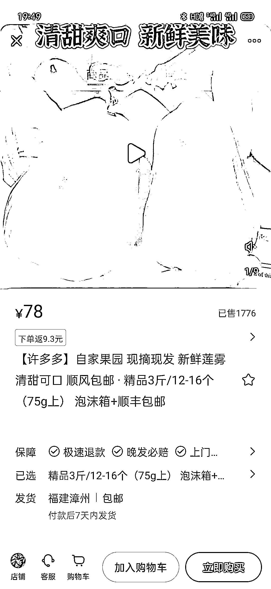

# 小红书新手卖出 1000+ 件商品，成功建立个人品牌

> 原文：[`www.yuque.com/for_lazy/xkrm14/zvqtps40luzbhggf`](https://www.yuque.com/for_lazy/xkrm14/zvqtps40luzbhggf)

作者： 沐琳

日期：2023-08-17

点赞数：89

正文：

小红书刚刷到的粉丝才几百，商品已经卖了 1000+，号可以立个人设，比如大学生创业，果园直发。

评论区：

看好你 : 这个有没有达人带货呢？

沐琳 : 好像没有

豆豆 : 有靠谱的供货商的话，水果确实是个很不错的品

孟子非 : 爆了一篇笔记，厉害的，刚看了下销量已经快 2000 了

孟子非 : 我做产地水果的，现在陷入到抖音直播投流的囧境😂

沐琳 : 我感觉小红书就是一直怼产品，总有爆的，只要爆了就能出单。

Alex : 🎉🎉🎉

