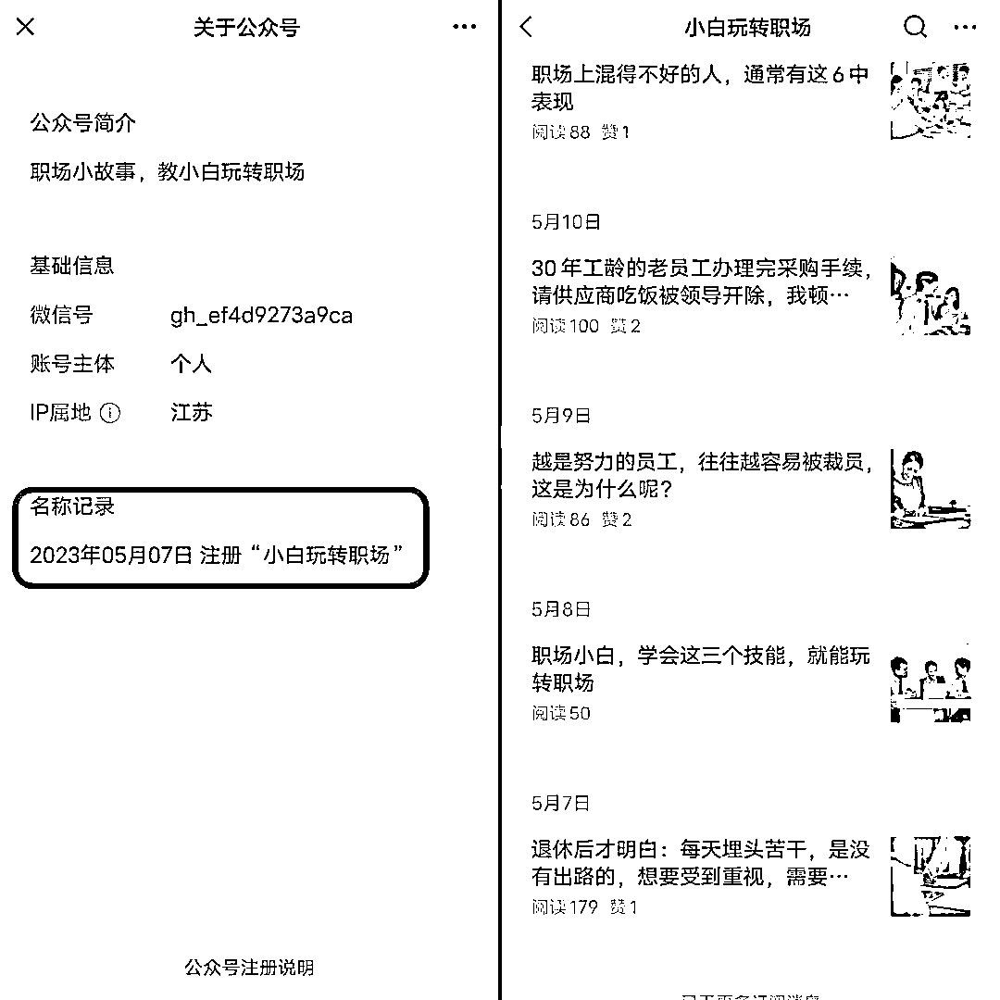

# 养老金赛道：小白玩转职场公众号爆文连连

> 原文：[`www.yuque.com/for_lazy/xkrm14/mtfge5nlgqq40vsm`](https://www.yuque.com/for_lazy/xkrm14/mtfge5nlgqq40vsm)

作者： LimBo

日期：2023-08-17

点赞数：333

正文：

养老金类型的公众号容易出爆文。 小白玩转职场这个号，篇篇 10w+，而且这并不是一个做了很久的老号，而是今年 5 月才注册不久的号。 之前这个号刚做的时候是往职场方向发展，所以取名叫小白玩转职场，但是发了一阵后数据不是很好于是就换风格做了养老金的内容。换到养老金赛道后就几乎篇篇 10w+。 这些内容一般从官方网站找就好，选一些内容再加上自己想法稍微改下，或者直接通过 Chatgpt 辅助，写好标题就行。

评论区：

枫晓陌 : 牛🐮

林元陸 : 这个变现就不要光靠平台补贴了，带货卖中老年爱用的品，或者开发相关的知识付费产品也是 OK 的！！！！

LimBo : 老年人专属记账本[呲牙]

亦仁 : 养老金 这个词有大机会。

亦仁 : 感谢分享，已加精华。

melisa : 真牛

LimBo : 莫名的惊喜，感谢[呲牙]

公众号懒人找资源，懒人专属群分享

